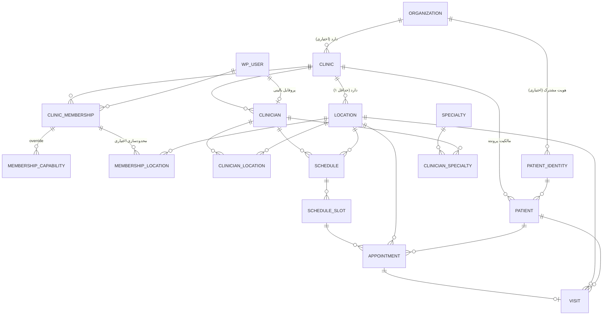

# PHASE 0.5 — TARGET ARCHITECTURE & MIGRATION PLAN

> **نوع:** Documentation Only — هیچ کد، هیچ Migration، هیچ Schema.
> **پایه:** `origin/main` = `8087b42e19a1721e38eb073aa1a17aff1cbac97b` (shallow clone، Working Tree تمیز)
> **وضعیت:** **FINALIZED** — تصویب‌شده توسط Product Owner. در checkpoint commit مستندات Phase 0/0.5 ثبت شد.
> **قاعدهٔ شواهد:** هر عدد در این سند از اجرای واقعی `grep`/parser روی کد فعلی آمده، نه از گزارش‌های قبلی.
> **ADR مرجع:** `docs/adr/ADR-0031-organization-clinic-location-scoped-authorization.md`
> **فازبندی مرجع:** Roadmap تأییدشدهٔ Owner (Phase 0..20) — `docs/roadmap/roadmap.md` §۰.

---

## ۰. تصمیمات معماری تصویب‌شده (Binding — مبنای همهٔ فازهای بعدی)

این ۱۳ تصمیم توسط Product Owner تصویب شده‌اند و **قابل بازتفسیر توسط هیچ ایجنتی نیستند.** مرجع رسمی‌شان **ADR-0031** است.

| # | تصمیم | وضعیت | فاز مالک |
|---|---|---|---|
| **AD-01** | **Multi-Clinic / Multi-Location جزو Core است** — نه افزودنی، نه V2، نه Feature Flag | ✅ DECIDED | Phase 2 |
| **AD-02** | **Organization اجباری است.** هیچ مسیر موازی برای `Organization = NULL` در Core ساخته نمی‌شود | ✅ DECIDED | Phase 2 |
| **AD-03** | **هر Clinic دقیقاً به یک Organization تعلق دارد** (`clinics.organization_id NOT NULL` + FK) | ✅ DECIDED | Phase 2 |
| **AD-04** | **مطب تک‌پزشکی هم از همان `Organization → Clinic → Location` استفاده می‌کند** — نه شاخهٔ کدی جدا | ✅ DECIDED | Phase 2 |
| **AD-05** | **User/Doctor می‌تواند عضو چند Clinic باشد** — `User↔Clinic` رابطهٔ **M:N** است | ✅ DECIDED | Phase 2/3 |
| **AD-06** | **Role/Authorization باید Scoped باشد** — نقش صفتِ رابطهٔ (User, Clinic) است، نه صفتِ User | ✅ DECIDED | Phase 3 |
| **AD-07** | **OTP در سطح Identity/Installation است**، نه Authorization کلینیک. `cpms_otp_tokens` عمداً `clinic_id` نمی‌گیرد | ✅ DECIDED | Phase 1 |
| **AD-08** | **Location منطقهٔ زمانی مستقل دارد** (`locations.timezone NOT NULL`). Canonical = UTC؛ نمایش/زمان‌بندی در TZ همان Location | ✅ DECIDED | Phase 2/6 |
| **AD-09** | **Patient Identity می‌تواند shared باشد، ولی Clinical Record و medical access باید scope-isolated باشند.** دسترسی بالینی ضمنی بین‌کلینیکی **ممنوع** است | ✅ DECIDED (جهت) | Phase 2/3 |
| **AD-10** | **WordPress `administrator` هیچ blanket clinical-data bypass ندارد** | ✅ DECIDED | Phase 3 |
| **AD-11** | **System Administration از Clinical Data Access جداست** (+ Break-Glass صریح، محدود، audit‌شده — طراحی‌شده، پیاده‌نشده) | ✅ DECIDED | Phase 3 |
| **AD-12** | **Migration strategy = versioned forward migrations.** drop/recreate مسیر محصول **نیست** | ✅ DECIDED | همهٔ فازها |
| **AD-13** | **`clinic_id = 1` مستقیم در کد جدید ممنوع است** — و به همان ترتیب `organization_id = 1` و `location_id = 1` | ✅ DECIDED | همهٔ فازها |

> **AD-13 — قاعدهٔ اجرایی:** ۵۴ مورد موجود بدهی فنی فاز ۲ هستند و در همان فاز حذف می‌شوند. اما **از امروز** هیچ خط کد جدیدی حق ندارد این الگو را اضافه کند. اجرای این قاعده در Phase 2 به یک architecture test سپرده می‌شود.
>
> **AD-09 — قید باز:** *جهت* «هویت مشترک + رکورد بالینی ایزوله» تصویب شده، ولی **مکانیزم identity-resolution/hashing هنوز تصویب نشده** (Q2 در بخش و). تا تصویب آن، جدول `cpms_patient_identities` ساخته نمی‌شود.

---

## پیش‌فرض‌های قطعی دریافت‌شده (بازبینی نشده، مبنای طراحی)

| # | پیش‌فرض |
|---|---|
| A1 | هیچ داده Production وجود ندارد ⇒ Backfill/Rollback روی داده واقعی لازم نیست |
| A2 | یک User می‌تواند هم‌زمان در چند Clinic فعال باشد ⇒ رابطهٔ `User↔Clinic` باید **M:N** باشد |
| A3 | Capability/Role باید **per-(User, Clinic)** ذخیره شود، نه Global روی User |
| A4 | فاز ۱ امنیتی به `1a` (مستقل از Scope) و `1b` (وابسته به Scope، بعد از فاز ۲) تقسیم شده |

---

# بخش الف — بازخوانی وضعیت فعلی (Read-Only، با شواهد اجرایی)

## الف-۱ — تأیید نبود دیتابیس زنده

```
$ ls /var/lib/mysql            → no /var/lib/mysql
$ ss -tln | grep -cE ":3306|:5432"  → 0
$ which mysql mysqld mariadb wp     → (none)
$ ls -d /var/www                    → (none)
```

**هیچ دیتابیس، هیچ نصب WordPress و هیچ داده Seed/Test محلی وجود ندارد.**
تنها Seed موجود، دو دستور داخل خودِ Migrationهاست:

| Migration | خط | Seed |
|---|---|---|
| `2026_09_05_0001_initial_schema.php` | 736 | `INSERT IGNORE INTO cpms_clinics (id,name,slug,timezone,...) VALUES (1,'کلینیک پیش‌فرض','default','Asia/Tehran',...)` |
| `2026_09_07_0008_licensing.php` | 84 | `INSERT INTO cpms_license_install ...` (install-id در زمان نصب) |

⇒ در بخش «د» به این نکته برمی‌گردیم: نگاشت داده Seed تقریباً بی‌معناست، چون فقط یک ردیف Clinic ثابت است.

## الف-۲ — ۴۱ جدول و همهٔ ستون‌های `*_id`

parser روی همهٔ Migrationها اجرا شد: **۴۰ جدول در فایل‌های Migration** + **۱ جدول** (`cpms_schema_migrations`) که توسط `MigrationRunner::ensureSchemaTable()` ساخته می‌شود = **۴۱**.

| جدول | ستون‌های `id`/`*_id` |
|---|---|
| `cpms_appointments` | id, **clinic_id**, clinician_id, patient_id, slot_id, wp_user_id, active_visit_id, cancelled_by_wp_user_id |
| `cpms_audit_logs` | id, **clinic_id**, actor_wp_user_id, resource_id, patient_id, session_id, request_id |
| `cpms_clinical_note_versions` | id, note_id, changed_by_wp_user_id |
| `cpms_clinical_notes` | id, **clinic_id**, visit_id, patient_id, clinician_id, correction_of_note_id, created_by_wp_user_id, updated_by_wp_user_id |
| `cpms_clinicians` | id, **clinic_id**, wp_user_id |
| `cpms_clinics` | id |
| `cpms_drug_reference` | id, **clinic_id** |
| `cpms_follow_ups` | id, **clinic_id**, visit_id, patient_id, clinician_id, linked_appointment_id |
| `cpms_handwriting_documents` | id, **clinic_id**, visit_id, patient_id, clinician_id |
| `cpms_handwriting_page_versions` | id, page_id |
| `cpms_handwriting_pages` | id, document_id, background_attachment_id¹ |
| `cpms_idempotency_keys` | id, **clinic_id**, wp_user_id, context_id |
| `cpms_invoice_items` | id, invoice_id, service_id |
| `cpms_invoices` | id, **clinic_id**, patient_id, visit_id, issued_by_wp_user_id |
| `cpms_jobs` | id |
| `cpms_license_install` | id, install_id |
| `cpms_license_state` | id, license_id, install_id |
| `cpms_medical_attachments` | id, **clinic_id**, patient_id, visit_id, uploaded_by_wp_user_id |
| `cpms_notifications` | id, **clinic_id**, recipient_wp_user_id, recipient_patient_id |
| `cpms_ocr_jobs` | id, **clinic_id**, source_page_id, reviewed_by_wp_user_id |
| `cpms_operational_logs` | id, request_id |
| `cpms_otp_tokens` | id |
| `cpms_patient_merges` | id, **clinic_id**, surviving_patient_id, merged_patient_id, merged_by_wp_user_id |
| `cpms_patient_user_links` | id, **clinic_id**, patient_id, wp_user_id |
| `cpms_patients` | id, **clinic_id**, national_id² |
| `cpms_payment_adjustments` | id, invoice_id, payment_id, approved_by_wp_user_id |
| `cpms_payments` | id, **clinic_id**, invoice_id, patient_id, received_by_wp_user_id, voided_by_wp_user_id |
| `cpms_prescription_items` | id, prescription_id, drug_ref_id, ocr_job_id |
| `cpms_prescriptions` | id, **clinic_id**, visit_id, patient_id, clinician_id, correction_of_prescription_id |
| `cpms_rate_limits` | window_id³ |
| `cpms_recommendations` | id, **clinic_id**, visit_id, patient_id, clinician_id |
| `cpms_schedule` | id, **clinic_id**, clinician_id |
| `cpms_schedule_exceptions` | id, **clinic_id**, clinician_id, created_by_wp_user_id |
| `cpms_schedule_slots` | id, **clinic_id**, clinician_id |
| `cpms_services` | id, **clinic_id** |
| `cpms_settings` | id, **clinic_id**, updated_by_wp_user_id |
| `cpms_slot_holds` | id, **clinic_id**, slot_id, holder_wp_user_id |
| `cpms_sms_messages` | id, **clinic_id**, template_id, provider_msg_id, context_id |
| `cpms_visit_status_history` | id, visit_id, actor_wp_user_id, request_id |
| `cpms_visits` | id, **clinic_id**, clinician_id, patient_id, appointment_id, cancelled_by_wp_user_id |
| `cpms_schema_migrations` | (کلید = `version VARCHAR(64)`، بدون `id`) |

¹ توسط `ALTER TABLE` در Migration `0004` اضافه شده، نه در `CREATE`.
² `national_id` شناسهٔ ملی بیمار است، نه FK.
³ `cpms_rate_limits` **ستون `id` ندارد**؛ کلیدش `window_id` است.

**جمع‌بندی:** **۲۵ جدول** ستون `clinic_id` دارند · **۱۶ جدول** ندارند.

## الف-۳ — ۳۹ Foreign Key و مقصد دقیق آنها

parser ۳۸ FK را از `CREATE TABLE` استخراج کرد؛ **FK سی‌ونهم** (`fk_hwpage_bg`) از طریق `ALTER TABLE` در Migration `0004` اضافه می‌شود:

```
cpms_handwriting_pages.background_attachment_id
    → cpms_medical_attachments(id)  ON DELETE SET NULL
```

| # | جدول مبدأ | ستون | مقصد | ON DELETE |
|---|---|---|---|---|
| 1 | appointments | clinician_id | clinicians(id) | — |
| 2 | appointments | patient_id | patients(id) | RESTRICT |
| 3 | appointments | slot_id | schedule_slots(id) | — |
| 4 | clinical_notes | visit_id | visits(id) | RESTRICT |
| 5 | clinical_notes | patient_id | patients(id) | RESTRICT |
| 6 | clinical_notes | clinician_id | clinicians(id) | — |
| 7 | **clinicians** | **clinic_id** | **clinics(id)** | — |
| 8 | follow_ups | visit_id | visits(id) | RESTRICT |
| 9 | follow_ups | linked_appointment_id | appointments(id) | SET NULL |
| 10 | handwriting_documents | visit_id | visits(id) | RESTRICT |
| 11 | handwriting_page_versions | page_id | handwriting_pages(id) | CASCADE |
| 12 | handwriting_pages | document_id | handwriting_documents(id) | CASCADE |
| 13 | handwriting_pages | background_attachment_id | medical_attachments(id) | SET NULL |
| 14 | invoice_items | invoice_id | invoices(id) | CASCADE |
| 15 | invoice_items | service_id | services(id) | SET NULL |
| 16 | invoices | patient_id | patients(id) | RESTRICT |
| 17 | invoices | visit_id | visits(id) | RESTRICT |
| 18 | medical_attachments | patient_id | patients(id) | RESTRICT |
| 19 | medical_attachments | visit_id | visits(id) | SET NULL |
| 20 | ocr_jobs | source_page_id | handwriting_pages(id) | RESTRICT |
| 21 | patient_user_links | patient_id | patients(id) | RESTRICT |
| 22 | **patients** | **clinic_id** | **clinics(id)** | — |
| 23 | payment_adjustments | invoice_id | invoices(id) | RESTRICT |
| 24 | payment_adjustments | payment_id | payments(id) | SET NULL |
| 25 | payments | invoice_id | invoices(id) | RESTRICT |
| 26 | prescription_items | prescription_id | prescriptions(id) | CASCADE |
| 27 | prescription_items | drug_ref_id | drug_reference(id) | SET NULL |
| 28 | prescriptions | visit_id | visits(id) | RESTRICT |
| 29 | prescriptions | patient_id | patients(id) | RESTRICT |
| 30 | recommendations | visit_id | visits(id) | RESTRICT |
| 31 | **schedule** | **clinic_id** | **clinics(id)** | — |
| 32 | schedule | clinician_id | clinicians(id) | — |
| 33 | schedule_exceptions | clinician_id | clinicians(id) | — |
| 34 | schedule_slots | clinician_id | clinicians(id) | — |
| 35 | **services** | **clinic_id** | **clinics(id)** | — |
| 36 | slot_holds | slot_id | schedule_slots(id) | CASCADE |
| 37 | visits | clinician_id | clinicians(id) | — |
| 38 | visits | patient_id | patients(id) | RESTRICT |
| 39 | visits | appointment_id | appointments(id) | — |

**یافتهٔ حیاتی:** فقط **۴ FK** به `cpms_clinics` اشاره می‌کنند (ردیف‌های ۷، ۲۲، ۳۱، ۳۵).
⇒ **۲۱ جدول از ۲۵ جدول دارای `clinic_id`، هیچ FK به Clinic ندارند.** یعنی امروز موتور دیتابیس هیچ تضمینی برای صحت `clinic_id` نمی‌دهد.

**۲۱ جدول بدون FK:**
`patient_user_links, patient_merges, idempotency_keys, schedule_exceptions, schedule_slots, slot_holds, appointments, visits, clinical_notes, handwriting_documents, ocr_jobs, prescriptions, drug_reference, recommendations, follow_ups, medical_attachments, invoices, payments, notifications, audit_logs, settings`

## الف-۴ — ۴۶ Capability و توزیع فعلی

`RolesAndCapabilities.php` دارای ۵۲ ثابت `'cpms_*` است = ۵ نقش + ۱ Option + **۴۶ Capability**. آرایهٔ `ALL_CAPS` نیز دقیقاً ۴۶ عضو دارد.

| نقش | Slug | تعداد Capability |
|---|---|---|
| Doctor | `cpms_doctor` | **۳۳** |
| Secretary | `cpms_secretary` | **۲۵** |
| Accountant | `cpms_accountant` | **۱۱** |
| Clinic Manager | `cpms_manager` | **۵** |
| Patient | `cpms_patient` | **۰** (فقط `read` وردپرس) |

**ماتریس کامل (وضعیت فعلی — کاملاً Global، بدون هیچ Scope):**

| Capability | SEC | DOC | ACC | MGR |
|---|:--:|:--:|:--:|:--:|
| cpms_patient_read | X | X | . | X |
| cpms_patient_create | X | . | . | . |
| cpms_patient_update | X | X | . | . |
| cpms_patient_archive | . | . | . | . |
| cpms_patient_merge | . | . | . | . |
| cpms_appt_read | X | X | . | . |
| cpms_appt_create | X | X | . | . |
| cpms_appt_confirm | X | X | . | . |
| cpms_appt_cancel | X | X | . | . |
| cpms_appt_reschedule | X | X | . | . |
| cpms_appt_no_show | X | X | . | . |
| cpms_visit_read | X | X | . | . |
| cpms_queue_read | X | X | . | . |
| cpms_queue_checkin | X | . | . | . |
| cpms_queue_advance | X | . | . | . |
| cpms_queue_call | . | X | . | . |
| cpms_queue_checkout | X | . | . | . |
| cpms_consult_start | . | X | . | . |
| cpms_consult_complete | . | X | . | . |
| cpms_consult_reopen | . | X | . | . |
| cpms_medical_read | . | X | . | . |
| cpms_note_create | . | X | . | . |
| cpms_note_update | . | X | . | . |
| cpms_rec_create | . | X | . | . |
| cpms_private_note_read | . | X | . | . |
| cpms_private_note_create | . | X | . | . |
| cpms_private_note_update | . | X | . | . |
| cpms_rx_read | . | X | . | . |
| cpms_rx_create | . | X | . | . |
| cpms_rx_void | . | X | . | . |
| cpms_file_upload | X | X | . | . |
| cpms_file_read | X | X | . | . |
| cpms_invoice_read | X | X | X | . |
| cpms_invoice_create | X | X | X | . |
| cpms_invoice_adjust | X | . | X | . |
| cpms_invoice_void | X | . | X | . |
| cpms_payment_create | X | . | X | . |
| cpms_payment_void | X | X | X | . |
| cpms_payment_refund | X | X | X | . |
| cpms_finance_read | X | X | X | . |
| cpms_report_read | . | X | X | X |
| cpms_export | . | . | X | . |
| cpms_audit_read | . | . | . | . |
| cpms_search | X | X | X | X |
| cpms_config | . | . | . | X |
| cpms_sms_config | . | . | . | X |

**۳ Capability به هیچ نقشی تعلق ندارند** (فقط از راه `administrator` یا Override قابل دسترسی‌اند):
`cpms_patient_archive` · `cpms_patient_merge` · `cpms_audit_read`

## الف-۵ — امروز Role چطور به User وصل است؟

```
$ grep -rn "usermeta|wp_users" src/ | grep -v wp_user_id
    → فقط StaffManagementPage برای نگهداری «نقش قبلی» هنگام غیرفعال‌سازی
```

**هیچ جدول `cpms_*` نگاشت User↔Role را ذخیره نمی‌کند.** مکانیزم کاملاً هستهٔ WordPress است:

```
wp_users  ──1:1──▶  wp_usermeta['{prefix}capabilities']  ──▶  یک نقش سراسری
                                                              (add_role / get_role)
```

`RolesAndCapabilities::registerRole()` در هر بوت:
1. اگر نقش نبود، `add_role($role,$label,$caps)`
2. اگر بود، Capabilityهای مفقود را `add_cap` و اضافه‌ها را `remove_cap` می‌کند
3. **Self-healing:** هر `cpms_*` خارج از فهرست مجاز آن نقش را حذف می‌کند

⇒ نتیجهٔ ساختاری: **یک کاربر امروز فقط یک نقش سراسری دارد و آن نقش هیچ ارتباطی با Clinic ندارد.** این دقیقاً همان نقطه‌ای است که پیش‌فرض A3 آن را نقض‌شده می‌داند.

## الف-۶ — سرشماری کاربرد `clinic_id`

| سنجه | مقدار | معنی |
|---|---|---|
| مجموع ذکر `clinic_id` در `src/` | **۱۴۳** | — |
| `clinic_id = 1` یا `'clinic_id' => 1` (hardcode) | **۵۴** در **۲۳ فایل** | نقض قانون ۵ |
| فیلتر `WHERE ... clinic_id` | **۴۴** | — |
| `clinic_id = %d` (پارامتری، سالم) | **۲۵** | لایهٔ Repository تا حد خوبی آماده است |

### 🔴 تصحیح — ادعای قبلی این بخش باطل شد

> **ادعای باطل‌شده (نسخهٔ اول این سند):** «hardcodeها عمدتاً خارج از Repository هستند؛ لایهٔ Repository تقریباً Scope-ready است؛ کار فاز ۲ فقط تزریق Context به لایهٔ Service است و حجم کار را به‌طور معناداری کم می‌کند.»
>
> **این ادعا غلط بود و در Documentation Reconciliation کشف شد.** توزیع واقعی:

| محل | تعداد hardcode | سهم |
|---|---|---|
| **داخل `src/Infrastructure/Repository/`** | **۲۴** | ۴۴٪ |
| **خارج از Repository** (Service / Admin / Jobs / Settings / Audit / Security) | **۳۰** | ۵۶٪ |
| **جمع (الگوی دقیق)** | **۵۴** | در **۲۳ فایل** |
| از این ۲۳ فایل، تعداد فایل‌های Repository | **۱۳ از ۲۳** | ۵۷٪ |

فرمان تأیید:
```
grep -rnE "clinic_id\s*=\s*1\b|'clinic_id'\s*=>\s*1\b" src --include=*.php | wc -l          → 54
… | grep    Infrastructure/Repository | wc -l                                                  → 24
… | grep -v Infrastructure/Repository | wc -l                                                  → 30
grep -rlE "…" src --include=*.php | wc -l                                                      → 23 فایل
```

**علاوه بر ۵۴ مورد دقیق، ۳ مورد Default-Parameter هم هست** که در الگوی بالا شمرده نمی‌شوند ولی همان اثر را دارند:

```
src/Infrastructure/Audit/AuditLogger.php:45        ?int $clinicId = 1
src/Infrastructure/Security/Idempotency.php:37     ?int $clinicId = 1
src/Settings/Settings.php:145                      private readonly int $clinicId = 1
```
⇒ سرشماری موسّع = **۵۷ مورد در ۲۶ فایل**. این سه مورد **خطرناک‌تر** از بقیه‌اند چون مقدار پیش‌فرض بی‌صدا اعمال می‌شود و در code review دیده نمی‌شود.

### پیامد واقعی برای فاز ۲ (بدون خوش‌بینی)

هم‌زیستی هر دو الگو در یک فایل واقعیت دارد: مثلاً `InvoiceRepository`، `PaymentRepository`، `VisitRepository`، `ClinicalNoteRepository`، `FollowUpRepository`، `PrescriptionRepository` و `ServiceRepository` **هم** `clinic_id = %d` دارند **هم** `clinic_id = 1`. یعنی لایهٔ Repository نیمه‌آماده است، نه آماده.

| گزارهٔ صحیح | نتیجه |
|---|---|
| لایهٔ Repository **هم باید بازنویسی شود** | ۱۳ فایل Repository آلوده‌اند |
| «فقط تزریق Context به Service کافی است» | **باطل** |
| ۲۵ نقطهٔ `clinic_id = %d` (در ۱۱ فایل) | نشان می‌دهد الگوی درست **بلد است**، نه اینکه **اعمال شده** |
| ۳ Default-Parameter | باید صریحاً حذف شوند (نه اینکه مقدارشان عوض شود) |

> **هیچ برآورد خوش‌بینانه‌ای از هزینهٔ فاز ۲ در این سند باقی نمانده است.** فاز ۲ شامل: ۸ جدول جدید + ۲۱ FK جدید + ۵۴ hardcode + ۳ Default-Parameter + ۲ UNIQUE برگشت‌ناپذیر + ساخت `ClinicContext` + بازنویسی هر دو لایهٔ Repository و Service. تخمین زمانی داده نمی‌شود (قاعدهٔ «بدون تخمین تقویمی»).

---

# بخش ب — Target ERD

## ب-۱ — نمودار



## ب-۲ — موجودیت‌های جدید

### `cpms_organizations`

| ستون | نوع | توضیح |
|---|---|---|
| `id` | BIGINT UNSIGNED AI | PK |
| `name` | VARCHAR(190) NOT NULL | |
| `slug` | VARCHAR(190) NOT NULL | UNIQUE |
| `status` | ENUM('active','suspended') DEFAULT 'active' | |
| `created_at` / `updated_at` | DATETIME(3) NOT NULL | |

> **[DECIDED Q1]** این جدول **اجباری** است. `cpms_clinics.organization_id` از نوع `NOT NULL` با FK به این جدول خواهد بود.

### `cpms_locations`

| ستون | نوع | توضیح |
|---|---|---|
| `id` | BIGINT UNSIGNED AI | PK |
| `clinic_id` | BIGINT UNSIGNED NOT NULL | FK → `cpms_clinics(id)` |
| `name` | VARCHAR(190) NOT NULL | «شعبهٔ مرکزی»، «مطب عصر» |
| `slug` | VARCHAR(190) NOT NULL | UNIQUE(clinic_id, slug) |
| `address` | VARCHAR(255) NULL | |
| `phone` | VARCHAR(32) NULL | |
| `timezone` | VARCHAR(64) **NOT NULL** | **[DECIDED Q7]** هر Location منطقهٔ زمانی مستقل دارد. در Migration از `clinic.timezone` مقداردهی اولیه می‌شود. `NULL` مجاز نیست تا مسیر موازی ساخته نشود |
| `is_primary` | TINYINT(1) DEFAULT 0 | دقیقاً یکی per clinic |
| `is_active` | TINYINT(1) DEFAULT 1 | |
| `created_at` / `updated_at` | DATETIME(3) NOT NULL | |

**ایندکس:** `UNIQUE (clinic_id, slug)` · `KEY (clinic_id, is_active)`

### `cpms_clinic_memberships` — جدول واسط M:N (بند A2 + A3)

| ستون | نوع | توضیح |
|---|---|---|
| `id` | BIGINT UNSIGNED AI | PK |
| `clinic_id` | BIGINT UNSIGNED NOT NULL | FK → `cpms_clinics(id)` ON DELETE CASCADE |
| `wp_user_id` | BIGINT UNSIGNED NOT NULL | کاربر وردپرس |
| `role_key` | VARCHAR(64) NOT NULL | `cpms_doctor` / `cpms_secretary` / `cpms_accountant` / `cpms_manager` / `cpms_patient` — **به‌عنوان Preset، نه نقش WP** |
| `scope_mode` | ENUM('clinic','location') DEFAULT 'clinic' | آیا عضویت به Locationهای خاص محدود است |
| `status` | ENUM('active','suspended') DEFAULT 'active' | |
| `is_primary` | TINYINT(1) DEFAULT 0 | Clinic پیش‌فرض این کاربر هنگام Login |
| `invited_by_wp_user_id` | BIGINT UNSIGNED NULL | |
| `created_at` / `updated_at` | DATETIME(3) NOT NULL | |

**ایندکس:** `UNIQUE (clinic_id, wp_user_id)` · `KEY (wp_user_id, status)` · `KEY (clinic_id, role_key, status)`

### `cpms_membership_capabilities` — Override دانه‌ریز per-(User, Clinic)

| ستون | نوع | توضیح |
|---|---|---|
| `id` | BIGINT UNSIGNED AI | PK |
| `membership_id` | BIGINT UNSIGNED NOT NULL | FK → `cpms_clinic_memberships(id)` ON DELETE CASCADE |
| `capability` | VARCHAR(64) NOT NULL | یکی از ۴۶ Capability |
| `effect` | ENUM('grant','deny') NOT NULL | `deny` بر `grant` غالب است |
| `created_at` | DATETIME(3) NOT NULL | |

**ایندکس:** `UNIQUE (membership_id, capability)`

> منطق حل: `effective = (deny ? false : (grant ? true : preset(role_key)))`

### `cpms_membership_locations` — محدودسازی عضویت به Location (اختیاری)

| ستون | نوع |
|---|---|
| `id` | BIGINT UNSIGNED AI |
| `membership_id` | BIGINT UNSIGNED NOT NULL → `cpms_clinic_memberships(id)` CASCADE |
| `location_id` | BIGINT UNSIGNED NOT NULL → `cpms_locations(id)` CASCADE |

**ایندکس:** `UNIQUE (membership_id, location_id)`
اگر `scope_mode = 'clinic'` این جدول برای آن عضویت خالی است ⇒ دسترسی به همهٔ Locationهای آن Clinic.

### `cpms_clinician_locations` — پزشک در چند محل (رفع C-7)

| ستون | نوع |
|---|---|
| `id` | BIGINT UNSIGNED AI |
| `clinician_id` | BIGINT UNSIGNED NOT NULL → `cpms_clinicians(id)` |
| `location_id` | BIGINT UNSIGNED NOT NULL → `cpms_locations(id)` |
| `is_primary` | TINYINT(1) DEFAULT 0 |

**ایندکس:** `UNIQUE (clinician_id, location_id)`

### `cpms_specialties` + `cpms_clinician_specialties`

`cpms_specialties`: `id`, `organization_id` NULL (NULL = سراسری), `name` VARCHAR(190), `slug` VARCHAR(190) UNIQUE, `is_active`
`cpms_clinician_specialties`: `id`, `clinician_id`, `specialty_id`, `is_primary` — `UNIQUE(clinician_id, specialty_id)`

> این جدول‌ها **اختراع دامنه نیستند** — ستون `specialty VARCHAR(190)` امروز وجود دارد و صرفاً نرمال‌سازی می‌شود.

### `cpms_patient_identities` — فقط اگر گزینهٔ P-B انتخاب شود (بخش ب-۴)

| ستون | نوع |
|---|---|
| `id` | BIGINT UNSIGNED AI |
| `organization_id` | BIGINT UNSIGNED NOT NULL → `cpms_organizations(id)` |
| `national_id_hash` | CHAR(64) NULL (SHA-256) |
| `mobile_hash` | CHAR(64) NULL |
| `created_at` | DATETIME(3) |

`cpms_patients` یک ستون `identity_id BIGINT UNSIGNED NULL` می‌گیرد.

## ب-۳ — [DECIDED] Organization لایهٔ اجباری Core است

**تصمیم Product Owner:** Organization **اجباری** است. هر Clinic دقیقاً به یک Organization تعلق دارد. زنجیرهٔ `Organization → Clinic → Location` حتی برای مطب تک‌پزشکی هم استفاده می‌شود. **مدل Core نباید هیچ مسیر موازی برای `Organization = NULL` بسازد.**

> پیشنهاد اولیهٔ من (`organization_id NULL`-able) **رد شد**. استدلال مالک محصول ارجح است: یک مسیر NULL-able در Core به‌مرور به شاخه‌های شرطی در Query، Authorization و Reporting تبدیل می‌شود و همان بدهی‌ای را می‌سازد که امروز با `clinic_id = 1` داریم.

**پیامدهای طراحی:**

| مورد | تصمیم |
|---|---|
| ستون | `cpms_clinics.organization_id BIGINT UNSIGNED **NOT NULL**` + FK → `cpms_organizations(id)` |
| Cardinality | `Organization 1 ──< Clinic` (اجباری در هر دو جهت خواندن: هر Clinic دقیقاً یک Org) |
| Migration | چون `NOT NULL` است، ترتیب سه‌مرحله‌ای الزامی است: (۱) ساخت `cpms_organizations` (۲) Seed یک Organization برای Clinic موجود (۳) `ADD COLUMN NULL` → `UPDATE` → `MODIFY NOT NULL` → `ADD FK` |
| Setup Wizard | گام «اطلاعات مجموعه» باید Organization را هم بسازد. برای مطب تک‌پزشکی می‌توان نام Organization را از نام Clinic پیش‌پر کرد تا اصطکاک UX صفر شود — **اما رکورد واقعی ساخته می‌شود، نه NULL** |
| تفاوت با آنتی‌پترن `clinic_id = 1` | Seed یک ردیف واقعی + FK اجباری ≠ سخت‌کدکردن مقدار `1` در Query. آنچه ممنوع است، **hardcode در کد** است نه **وجود یک ردیف پیش‌فرض در داده** |
| قاعدهٔ الزام‌آور | هیچ‌جا در کد نباید `organization_id = 1` نوشته شود. مقدار همیشه از Context یا از `clinic.organization_id` خوانده می‌شود |

## ب-۴ — تصمیم باز #۲: Patient در سطح Clinic یا Organization؟

### گزینهٔ P-A — بیمار ایزوله در سطح Clinic (وضع فعلی)

`cpms_patients.clinic_id` باقی می‌ماند؛ هر Clinic پروندهٔ کاملاً جدا دارد.

**مزایا:** ساده‌ترین · منطبق بر یکتایی فعلی (`UNIQUE(clinic_id, mrn/mobile/national_id)`) · دیوار حریم خصوصی طبیعی · صفر تغییر در جدول بیماران
**معایب:** بیماری که به دو کلینیک هم‌سازمان مراجعه می‌کند دو پرونده و دو MRN دارد · گزارش سازمانی «تعداد بیماران یکتا» غیرممکن · تجربهٔ بیمار در پنل self-service دوپاره

**ریسک‌های حریم خصوصی:** ⬇️ **پایین** — هیچ PHI بین کلینیک‌ها جاری نمی‌شود.

### گزینهٔ P-B — هویت مشترک، پروندهٔ جدا (پیشنهاد من)

`cpms_patients` همچنان `clinic_id`-owned می‌ماند (پرونده و همهٔ داده‌های بالینی کاملاً جدا)، اما یک `identity_id` اختیاری به `cpms_patient_identities` (سطح Organization) اضافه می‌شود که **فقط شناسه‌های هش‌شده** را نگه می‌دارد.

**مزایا:** یک بار OTP برای بیمار در کل سازمان · «کلینیک‌های من» در پنل بیمار · گزارش بیمار یکتا در سطح سازمان · **هیچ داده بالینی مشترک نمی‌شود**
**معایب:** یک لایهٔ مفهومی اضافه · نیازمند سیاست صریح ادغام/تفکیک هویت

**ریسک‌های حریم خصوصی:** ⬆️ **متوسط** —
- **R-P1:** صرفِ وجود Identity مشترک افشا می‌کند که «این فرد در کلینیک X هم پرونده دارد». حتی همین متادیتا در پزشکی حساس است (مثلاً کلینیک روان‌پزشکی).
  **کاهش:** `identity_id` هرگز نباید در هیچ API سطح Clinic برگردانده شود؛ فقط سرویس سطح Organization با Capability اختصاصی به آن دسترسی دارد.
- **R-P2:** خطای پیاده‌سازی در JOIN می‌تواند PHI را بین کلینیک‌ها نشت دهد.
  **کاهش:** ممنوعیت مطلق JOIN مستقیم بین `patients` دو Clinic؛ فقط از راه سرویس صریح.
- **R-P3:** ادغام هویت اشتباه = ادغام دو انسان متفاوت.
  **کاهش:** فقط تطبیق `national_id_hash`؛ هرگز فقط با `mobile_hash`.

### گزینهٔ P-C — بیمار کاملاً در سطح Organization

`clinic_id` از `cpms_patients` حذف شود و همهٔ کلینیک‌های یک سازمان یک پروندهٔ واحد ببینند.

**ریسک حریم خصوصی:** 🔴 **بالا** — پیش‌فرض به «همه می‌بینند» تغییر می‌کند و ADR-0027 §5 را نقض می‌کند («دسترسی بالینی بین پزشکان تابع Authorization صریح است»). **توصیه نمی‌شود.**

**پیشنهاد نهایی: P-B** — **جهت مورد قبول اولیهٔ Product Owner است، اما مکانیزم hashing/identity-resolution هنوز تأیید نشده.** هفت مسئلهٔ باز در بخش ب-۴-۱ تحلیل شده‌اند و باید پیش از تثبیت مدل تصمیم‌گیری شوند.

**قید الزام‌آور مالک محصول:** «هیچ دسترسی بالینی بین‌کلینیکی به‌صورت ضمنی مجاز نیست.» یعنی حتی با Identity مشترک، `cpms_patients` و تمام داده‌های بالینی وابسته **per-Clinic ایزوله می‌مانند** و هر دسترسی بین‌کلینیکی نیازمند Scope صریح و تصویب‌شده است.

## ب-۴-۱ — هفت مسئلهٔ باز مدل P-B (تحلیل پیش از تثبیت)

### ۱) Mobile normalization

**وضعیت فعلی (شاهد: `src/Domain/Validators/MobileValidator.php`):** تابع `normalize()` خروجی متعارف `09xxxxxxxxx` (۱۱ رقم) می‌دهد و این ورودی‌ها را می‌پذیرد: `09121234567`, `9121234567`, `+989121234567`, `00989121234567`, و فرم‌های فاصله‌دار. تابع `mask()` برای Audit شکل `0912***5678` می‌سازد.

**محدودیت:** پیاده‌سازی **فقط ایران** است. هیچ پشتیبانی E.164 برای شماره‌های غیرایرانی وجود ندارد؛ `+971...` به `null` تبدیل می‌شود.

**پیامد برای Identity:** اگر کلید هویت `mobile_hash` باشد، هش باید **روی خروجی `normalize()` گرفته شود، نه ورودی خام** — وگرنه یک نفر با دو فرمت ورودی، دو Identity می‌سازد. این قاعده باید در تست معماری قفل شود.
**تصمیم لازم:** آیا شماره‌های بین‌المللی در دامنهٔ V1 هستند؟ اگر بله، `MobileValidator` باید به E.164 مهاجرت کند و این یک تغییر شکستنده روی `UNIQUE(clinic_id, mobile)` است.

### ۲) Mobile change (تغییر شمارهٔ موبایل)

**وضعیت فعلی:** هیچ جریان «تغییر شماره» وجود ندارد. اما `cpms_patient_user_links` ستون `mobile_at_link VARCHAR(32) NOT NULL` دارد — یعنی طراح اولیه **snapshot شماره در لحظهٔ اتصال** را پیش‌بینی کرده بود، هرچند از آن برای re-verification استفاده نمی‌شود.

**مسئله:** اگر `mobile_hash` کلید Identity باشد، تغییر شماره یعنی تغییر Identity ⇒ بیمار تاریخچه‌اش را گم می‌کند، یا بدتر: اگر شماره به فرد دیگری واگذار شود، فرد جدید به Identity قبلی وصل می‌شود.

**گزینه‌ها:** (الف) Identity کلید پایدار مستقل (`ULID`) داشته باشد و `mobile_hash` فقط یک **کلید جستجوی قابل‌تغییر** باشد — امن‌تر · (ب) `mobile_hash` خودِ کلید باشد — ساده‌تر، ولی شکننده.
**پیشنهاد من: (الف).** **تصمیم باز.**

### ۳) Collision (برخورد هش)

با SHA-256 برخورد رمزنگاشتی عملاً صفر است. **اما مسئلهٔ واقعی برخورد هش نیست، بلکه برخورد معنایی است:** دو انسان متفاوت که یک شماره را در دو زمان مختلف داشته‌اند (بازیافت شمارهٔ سیم‌کارت در ایران رایج است) هش یکسان تولید می‌کنند.

**نکتهٔ امنیتی مهم:** فضای شمارهٔ موبایل ایران کوچک است (~۱۰⁹). یک `sha256(mobile)` بدون salt/pepper **در چند دقیقه با rainbow table معکوس می‌شود** ⇒ اگر جدول Identity نشت کند، همهٔ شماره‌ها لو می‌روند. همین ایراد برای `national_id` (۱۰ رقمی، فضای ~۱۰¹⁰) شدیدتر است.
**الزام:** هر هش هویتی باید **keyed** باشد (HMAC-SHA256 با کلید سرور یا Argon2id)، نه SHA-256 خام. **این نکته باید پیش از تصویب مدل حل شود.**

### ۴) Patient merge

**وضعیت فعلی (شاهد):** جدول `cpms_patient_merges` وجود دارد با `clinic_id`, `surviving_patient_id`, `merged_patient_id`, `merged_by_wp_user_id`, `reason`, `mapping_json`, `merged_at`. Capability `cpms_patient_merge` هم تعریف شده — **اما به هیچ نقشی تعلق ندارد**.
**اما:** `grep "function .*[Mm]erge"` روی `PatientService` و `PatientRepository` ⇒ **صفر نتیجه.** یعنی **Merge فقط schema است و هیچ پیاده‌سازی ندارد.**

**پیامد:** طراحی Identity نمی‌تواند به Merge موجود تکیه کند. ضمناً Merge فعلی ذاتاً **درون‌کلینیکی** است (`clinic_id` دارد) و مدل P-B یک نوع دوم می‌طلبد: «ادغام Identity» در سطح Organization که **هیچ رکورد بالینی را جابه‌جا نمی‌کند**. این دو باید صریحاً از هم تفکیک شوند.

### ۵) Duplicate identity

سناریو: بیمار در Clinic A با شماره ثبت می‌شود، در Clinic B با کد ملی. اگر تطبیق فقط روی یک فیلد باشد، دو Identity ساخته می‌شود.
**گزینه‌ها:** (الف) تطبیق فقط با `national_id` — دقیق ولی کم‌پوشش (کد ملی امروز `NULL`-able است) · (ب) تطبیق با شماره — پرپوشش ولی مستعد خطای بازیافت سیم‌کارت · (ج) تطبیق پیشنهادی + **تأیید انسانی**.
**پیشنهاد من: (ج) — هیچ ادغام خودکاری.** **تصمیم باز.**

### ۶) Cross-clinic discovery

**این خطرناک‌ترین بخش مدل است.** اگر هر API ای بتواند بگوید «این Identity در کلینیک X هم پرونده دارد»، خودِ همین متادیتا افشای پزشکی است (مثال: کلینیک روان‌پزشکی، اعتیاد، ناباروری).

**الزامات پیشنهادی:**
- `identity_id` **هرگز** در هیچ پاسخ API سطح Clinic برنگردد
- هیچ Endpoint ای نباید فهرست کلینیک‌های یک Identity را برگرداند مگر با Capability اختصاصی سطح Organization
- ممنوعیت مطلق `JOIN` مستقیم بین `cpms_patients` دو Clinic
- «کلینیک‌های من» در پنل بیمار فقط بر پایهٔ **رضایت صریح بیمار** ساخته شود، نه به‌طور پیش‌فرض

### ۷) Privacy implications — جمع‌بندی

| ریسک | شدت | کاهش‌دهنده |
|---|---|---|
| نشت جدول Identity ⇒ معکوس‌سازی شماره/کد ملی | **بالا** | HMAC با کلید سرور، نه SHA-256 خام |
| افشای متادیتای «حضور در کلینیک X» | **بالا** | عدم بازگشت `identity_id`؛ Capability اختصاصی |
| ادغام اشتباه دو انسان | **بالا** | تأیید انسانی اجباری؛ عدم اتکا به شماره تنها |
| بازیافت سیم‌کارت ⇒ دسترسی به Identity غیر | **بالا** | کلید پایدار مستقل + re-verification در تغییر شماره |
| نشت PHI بین کلینیک از راه خطای JOIN | **متوسط** | تست معماری + ایزولاسیون در لایهٔ Repository |

> **نتیجه:** جهت P-B تأیید اولیه دارد، ولی **مکانیزم آن `NEEDS OWNER DECISION` است.** بدون حل بندهای ۱، ۲، ۳ و ۵ نباید ستون `identity_id` ساخته شود.

## ب-۵ — نگاشت ۲۵ جدول دارای `clinic_id` به سطح FK جدید

قاعدهٔ تصمیم:
- **Location** ← اگر رکورد به یک رویداد فیزیکی در یک مکان مشخص گره خورده (نوبت، ویزیت، برنامه، صف)
- **Clinic** ← اگر رکورد در سطح کلینیک مشترک است (بیمار، خدمت، تنظیمات، لاگ)

| # | جدول | `clinic_id` | `location_id` جدید | توضیح |
|---|---|:--:|:--:|---|
| 1 | `cpms_clinicians` | ✅ FK | ❌ | محل‌ها از راه `cpms_clinician_locations` (M:N) |
| 2 | `cpms_patients` | ✅ FK | ❌ | پرونده متعلق به Clinic است، نه شعبه |
| 3 | `cpms_patient_user_links` | ✅ +FK | ❌ | |
| 4 | `cpms_patient_merges` | ✅ +FK | ❌ | |
| 5 | `cpms_idempotency_keys` | ✅ +FK | ❌ | زیرساخت |
| 6 | **`cpms_schedule`** | ✅ FK | ✅ **NOT NULL** | 🔴 کلید یکتا باید بشکند — ب-۶ |
| 7 | `cpms_schedule_exceptions` | ✅ +FK | ✅ **NULL** | NULL = تعطیلی در همهٔ محل‌ها |
| 8 | **`cpms_schedule_slots`** | ✅ +FK | ✅ **NOT NULL** | یکتایی باید شامل location شود |
| 9 | `cpms_slot_holds` | ✅ +FK | ❌ | از `slot_id` ارث می‌برد |
| 10 | **`cpms_appointments`** | ✅ +FK | ✅ **NOT NULL** | snapshot، مثل `slot_date`/`slot_time` |
| 11 | **`cpms_visits`** | ✅ +FK | ✅ **NOT NULL** | صف per-location |
| 12 | `cpms_clinical_notes` | ✅ +FK | ❌ | داده بالینی، نه رویداد مکانی |
| 13 | `cpms_handwriting_documents` | ✅ +FK | ❌ | |
| 14 | `cpms_ocr_jobs` | ✅ +FK | ❌ | |
| 15 | `cpms_prescriptions` | ✅ +FK | ✅ **NULL** | فقط برای سربرگ چاپ |
| 16 | `cpms_drug_reference` | ✅ +FK | ❌ | کاتالوگ |
| 17 | `cpms_recommendations` | ✅ +FK | ❌ | |
| 18 | `cpms_follow_ups` | ✅ +FK | ❌ | |
| 19 | `cpms_medical_attachments` | ✅ +FK | ❌ | |
| 20 | `cpms_services` | ✅ FK | ✅ **NULL** | NULL = تعرفه در همهٔ محل‌ها |
| 21 | **`cpms_invoices`** | ✅ +FK | ✅ **NULL** | برای تفکیک درآمد per-location |
| 22 | `cpms_payments` | ✅ +FK | ✅ **NULL** | محل دریافت وجه |
| 23 | `cpms_notifications` | ✅ +FK | ❌ | |
| 24 | `cpms_audit_logs` | ✅ +FK | ✅ **NULL** | زمینهٔ رویداد |
| 25 | `cpms_settings` | ✅ +FK | ✅ **NULL** | NULL = تنظیم سطح Clinic؛ non-NULL = Override شعبه |

«✅ +FK» = ستون امروز هست اما **FK ندارد** و باید اضافه شود (۲۱ مورد).

**۱۶ جدول بدون `clinic_id`:**

| جدول | تصمیم |
|---|---|
| `cpms_clinics` | `organization_id BIGINT NULL` می‌گیرد |
| `cpms_visit_status_history` | از `visit_id` ارث می‌برد — بدون تغییر |
| `cpms_clinical_note_versions` | از `note_id` — بدون تغییر |
| `cpms_handwriting_pages` / `_page_versions` | از سلسله‌مراتب — بدون تغییر |
| `cpms_prescription_items` | از `prescription_id` — بدون تغییر |
| `cpms_invoice_items` | از `invoice_id` — بدون تغییر |
| `cpms_payment_adjustments` | از `invoice_id` — بدون تغییر |
| `cpms_jobs` | ⚠️ **باید `clinic_id NULL` بگیرد** (NULL = سیستمی) — رفع C-9 |
| `cpms_otp_tokens` | ✅ **[DECIDED] بدون تغییر — `clinic_id` نمی‌گیرد.** OTP یک نگرانی Identity/Authentication است، نه Clinic Authorization. توکن در سطح installation/identity می‌ماند. اگر OTP برای یک workflow خاص صادر شود، `purpose`/`context` امن ثبت می‌شود و Authorization کلینیک **جداگانه و بعد از احراز هویت** انجام می‌گیرد |
| `cpms_rate_limits` | ⏳ **Q6 باز** — سراسری / per-Clinic / دوسطحی |
| `cpms_operational_logs` | `clinic_id NULL` (اختیاری، برای تفکیک لاگ) |
| `cpms_license_install` / `_state` | ❌ **سطح نصب است، نه Clinic** — بدون تغییر |
| `cpms_schema_migrations` | ❌ بدون تغییر |
| `cpms_sms_messages` | از قبل `clinic_id` دارد ✅ |

## ب-۶ — شکستن `u_sched_day` (بحرانی‌ترین تغییر)

**امروز:**
```sql
UNIQUE KEY u_sched_day (clinician_id, day_of_week)
```
⇒ یک پزشک در کل سیستم فقط **یک** ردیف برنامه برای هر روز هفته. نه چند شعبه، نه دو شیفت.

**هدف:**
```sql
UNIQUE KEY u_sched_slot (clinic_id, location_id, clinician_id, day_of_week, start_time)
KEY idx_sched_lookup (clinician_id, day_of_week, is_active)
```
⇒ چند شعبه در یک روز **و** چند شیفت در یک شعبه، هر دو ممکن می‌شوند.

همچنین `cpms_schedule_slots`:
```sql
-- امروز:  UNIQUE (clinician_id, slot_date, slot_time)
-- هدف:    UNIQUE (location_id, clinician_id, slot_date, slot_time)
```

---

# بخش ج — Scope Model برای Permission

## ج-۱ — منبع حقیقت جدید

```
                    ┌──────────────────────────────────────┐
   WP Role          │ فقط برای دسترسی پایهٔ wp-admin (read) │
   (سراسری)         │ هیچ Capability پزشکی روی آن نمی‌ماند │
                    └──────────────────────────────────────┘
                                    │
   منبع حقیقت مجوز ────────────────▶ cpms_clinic_memberships
                                     + cpms_membership_capabilities (override)
                                     + cpms_membership_locations   (محدودهٔ مکانی)
```

**تغییر بنیادی:** امروز `current_user_can('cpms_note_create')` پاسخ **سراسری** می‌دهد. در مدل هدف، این سؤال **بدون Clinic بی‌معناست**.

> ⚠️ نکتهٔ سازگاری: `RolesAndCapabilities::registerRole()` امروز Capabilityهای `cpms_*` را روی نقش WP می‌نشاند و Self-healing می‌کند. در مدل هدف این Capabilityها باید از نقش WP **برداشته** شوند تا دو منبع حقیقت هم‌زمان وجود نداشته باشد. زمان‌بندی این کار یک **تصمیم باز** است (بخش و).

## ج-۲ — یک Endpoint دقیقاً چه چیزی را چک می‌کند؟

پنج بررسی، **به همین ترتیب**، همگی سمت سرور:

| # | بررسی | شکست ⇒ |
|---|---|---|
| ۱ | **Authentication** — کاربر وارد شده؟ + Nonce معتبر؟ | `401` / `403 CLINIC_INVALID_NONCE` |
| ۲ | **Clinic Resolution** — `clinic_id` مؤثر چیست؟ (از هدر/پارامتر یا Clinic پیش‌فرض) | `400 CLINIC_SCOPE_REQUIRED` |
| ۳ | **Membership** — آیا رکورد `(wp_user_id, clinic_id, status='active')` وجود دارد؟ | `403 CLINIC_NOT_MEMBER` |
| ۴ | **Capability** — آیا Capability مؤثر در آن Membership برقرار است؟ | `403 CLINIC_FORBIDDEN` |
| ۵ | **Object Ownership** — آیا `resource.clinic_id == clinic_id مؤثر`؟ و در صورت لزوم `resource.location_id ∈ محل‌های مجاز`؟ و در صورت لزوم مالکیت پزشک؟ | `404` (نه `403` — برای جلوگیری از افشای وجود منبع) |

**قاعدهٔ کلیدی:** لایهٔ ۵ **هرگز نباید به فیلتر ارسالی کلاینت اعتماد کند**. مطابق ADR-0027 §3، اگر کلاینت `clinician_id=123` بفرستد، سرور باید مستقلاً دسترسی را تأیید کند.

## ج-۳ — الگوی پیشنهادی `can()` (فقط طراحی، بدون پیاده‌سازی)

```
AuthorizationService::can(
    int          $wpUserId,
    string       $capability,      // یکی از ۴۶ Capability
    ScopeContext $scope            // { clinicId, ?locationId, ?resource }
) : Decision                       // { allowed:bool, reason:string, code:string }
```

**`ScopeContext`** — یک Value Object تغییرناپذیر:
```
clinicId    : int          (اجباری — بدون آن پاسخ نداریم)
locationId  : ?int         (اگر عملیات مکان‌محور است)
resource    : ?ResourceRef { type:string, id:int, clinicId:int, locationId:?int, ownerClinicianId:?int }
```

**ترتیب ارزیابی داخلی:**
```
1. membership = findActiveMembership(wpUserId, scope.clinicId)
   if none                          → DENY  CLINIC_NOT_MEMBER
2. if membership.scope_mode = 'location' and scope.locationId not in allowedLocations
                                    → DENY  CLINIC_LOCATION_FORBIDDEN
3. effective = resolveCapability(membership, capability)
      deny-override  > grant-override > preset(role_key)
   if not effective                 → DENY  CLINIC_FORBIDDEN
4. if scope.resource != null:
      if resource.clinicId   != scope.clinicId            → DENY  CLINIC_RESOURCE_MISMATCH
      if resource.locationId not in allowedLocations      → DENY  CLINIC_LOCATION_FORBIDDEN
      if capability requires ownership and
         resource.ownerClinicianId != membership.clinicianId → DENY  CLINIC_NOT_OWNER
5. ALLOW
```

**قواعد الزام‌آور برای همهٔ Endpointها:**

| قاعده | شرح |
|---|---|
| **تک‌مسیره** | هیچ Endpoint حق ندارد مستقیماً `current_user_can()` با Capability `cpms_*` صدا بزند. تنها مسیر مجاز `AuthorizationService::can()` است. |
| **Fail-closed** | نبود `ScopeContext` = رد، نه عبور. |
| **تست معماری** | یک تست خودکار باید تضمین کند هیچ فایلی خارج از `AuthorizationService` رشتهٔ `current_user_can('cpms_` را ندارد. |
| **کش per-request** | Membership و Capabilityها یک بار در هر درخواست خوانده و در حافظه کش شوند (نه `wp_cache` بین‌درخواستی، به‌دلیل حساسیت مجوز). |
| **Audit** | هر `DENY` با `code` در `cpms_audit_logs` ثبت شود. |
| **بدون افشا** | شکست لایهٔ ۵ باید `404` برگرداند، نه `403`. |

## ج-۵ — [DECIDED Q4] Dual-Mode و برنامهٔ Deprecation

**تصمیم:** Capabilityهای legacy روی نقش‌های WordPress **فعلاً حذف نمی‌شوند**. Scoped Authorization به‌تدریج authoritative می‌شود. حذف legacy فقط پس از Phase 1b/3 و تست سازگاری/مهاجرت قابل بررسی است. **Dual-mode نباید دائمی بماند.**

| مرحله | رفتار `AuthorizationService::can()` | نقش WP |
|---|---|---|
| **D0 — امروز** | وجود ندارد | تنها منبع حقیقت |
| **D1 — Shadow** (فاز ۲) | محاسبه می‌شود، **نتیجه اعمال نمی‌شود**؛ فقط اختلاف با `current_user_can` در OpLog ثبت می‌گردد | تنها منبع حقیقت |
| **D2 — Enforce + Fallback** (فاز 1b) | authoritative؛ اگر Membership نبود، به نقش WP سقوط می‌کند (با ثبت `AUTHZ_FALLBACK`) | پشتیبان |
| **D3 — Enforce Only** (فاز ۳) | تنها منبع حقیقت | فقط `read` برای ورود به wp-admin |
| **D4 — Cleanup** (پس از تأیید جداگانه) | — | Capabilityهای `cpms_*` از نقش‌ها حذف می‌شوند |

**شرط خروج از D2 (معیار عینی، نه سلیقه‌ای):** شمارندهٔ `AUTHZ_FALLBACK` در OpLog برای یک بازهٔ تعریف‌شده **صفر** باشد ⇒ یعنی هیچ کاربری بدون Membership باقی نمانده.

**سه محافظ الزام‌آور در دورهٔ Dual-Mode:**
1. `RolesAndCapabilities::registerRole()` امروز Self-healing دارد و هر `cpms_*` خارج از فهرست را حذف می‌کند. تا D4 این رفتار **باید دست‌نخورده بماند**، وگرنه دو منبع حقیقت واگرا می‌شوند.
2. در D1/D2 هیچ تصمیمی نباید **صرفاً** بر پایهٔ نقش WP دسترسی را **گسترش** دهد — سقوط به نقش WP فقط برای جلوگیری از قطع سرویس است، نه برای اعطای دسترسی جدید.
3. یک متریک قابل مشاهده در `SystemPage`: «تعداد کاربران بدون Membership» — تا زمانی که غیرصفر است، D3 مجاز نیست.

## ج-۶ — [DECIDED Q13] تفکیک System Administration از Clinical Data Access + Break-Glass

**تصمیم:** `administrator` وردپرس **نباید** دور زدن سراسری دادهٔ بالینی داشته باشد. System Administration از Clinical Data Access جدا می‌شود. برای جلوگیری از lockout یک مکانیزم recovery/break-glass **صریح، محدود و audit‌شده** طراحی می‌شود. **فعلاً فقط طراحی — بدون پیاده‌سازی.**

**تفکیک دو حوزه:**

| حوزه | نمونه‌ها | مبنای مجوز |
|---|---|---|
| **System Administration** | نصب/بروزرسانی، بکاپ/بازیابی، لایسنس، تنظیمات SMS، سلامت سیستم، مدیریت کاربران | `manage_options` وردپرس |
| **Clinical Data Access** | بیمار، ویزیت، یادداشت، نسخه، فایل پزشکی، صف، مالی | **فقط** `AuthorizationService::can()` با Membership معتبر |

⚠️ نکتهٔ ظریف: بکاپ حاوی PHI است. بنابراین «System Admin بدون دسترسی بالینی» یک مرز **منطقی** است نه فیزیکی — دارندهٔ `manage_options` همچنان می‌تواند dump بگیرد. این محدودیت باید صادقانه مستند شود و در سطح **قرارداد و Audit** مدیریت گردد، نه ادعای فنی غیرواقعی.

**طراحی Break-Glass (پیشنهادی — نیازمند تأیید):**

| ویژگی | طراحی |
|---|---|
| چه کسی | فقط کاربر دارای `manage_options` |
| چطور | یک اقدام صریح در `SystemPage` با تأیید دومرحله‌ای و **الزام وارد کردن دلیل متنی** |
| چه چیزی می‌دهد | یک Membership **موقت** با `role_key='cpms_manager'` روی یک Clinic مشخص — نه دسترسی سراسری، نه دسترسی به همهٔ کلینیک‌ها |
| مدت | حداکثر ۶۰ دقیقه، با انقضای خودکار (`expires_at` روی همان رکورد Membership) |
| دامنه | دقیقاً یک Clinic در هر بار فعال‌سازی |
| Audit | ثبت `BREAK_GLASS_ACTIVATED` با actor، clinic، دلیل، IP و زمان انقضا در `cpms_audit_logs` (زنجیرهٔ hash موجود) |
| اعلان | ارسال اعلان به همهٔ اعضای فعال `cpms_manager` آن Clinic — تا فعال‌سازی مخفی نماند |
| بازگشت | خودکار در انقضا + امکان ابطال دستی |
| آنچه **نمی‌دهد** | ❌ دسترسی به `private_note` سایر پزشکان · ❌ دسترسی چندکلینیکی هم‌زمان · ❌ تمدید نامحدود |

**سناریوی lockout که این مکانیزم حل می‌کند:** آخرین `cpms_manager` یک Clinic حذف/غیرفعال می‌شود ⇒ هیچ‌کس نمی‌تواند Membership جدید بسازد. Break-glass تنها راه خروج است.

## ج-۷ — چطور `clinic_id` مؤثر تعیین می‌شود؟

| منبع | اولویت | توضیح |
|---|---|---|
| هدر `X-CPMS-Clinic-Id` | ۱ | برای REST |
| پارامتر `clinic_id` در Query/Body | ۲ | |
| Clinic پیش‌فرض کاربر (`is_primary = 1`) | ۳ | |
| اگر کاربر فقط **یک** Membership فعال دارد | ۴ | انتخاب خودکار — پشتیبانی از حالت تک‌کلینیکی طبق ADR-0027 §2 |
| در غیر این صورت | — | `400 CLINIC_SCOPE_REQUIRED` |

⚠️ در هر چهار حالت، منبع فقط **پیشنهاد** می‌دهد؛ **لایهٔ ۳ (Membership) همیشه اجرا می‌شود.**

---

# بخش د — Migration Plan

## د-۱ — [DECIDED Q3] استراتژی: Versioned Forward ALTER

**تصمیم Product Owner:** «Versioned forward ALTER migrations را انتخاب می‌کنیم، نه drop & recreate. حتی با صفر بودن Production data، upgrade path محصول باید از ابتدا سالم و قابل تست باقی بماند.»

این تصمیم با تحلیل فنی من هم‌راستاست. شواهد پشتیبان:

| # | دلیل | شاهد |
|---|---|---|
| ۱ | **`MigrationRunner` forward-only و افزایشی است.** جدول `cpms_schema_migrations` نسخه‌ها را نگه می‌دارد و migration تکراری را رد می‌کند | `MigrationRunner.php:68-107` |
| ۲ | **چهار گیت CI روی نصب واقعی WordPress:** `Staging Gate (fresh install → restore drill)`، `Upgrade path (main → RC)`، `Closure — destructive restoreApply`، `Real WP Acceptance` | `.github/workflows/closure-gate.yml` |
| ۳ | نسخهٔ `1.0.0` با زیرساخت Update امضاشده منتشر شده (`WpUpdateBridge` روی ۳ فیلتر) | `App.php:188-190` |
| ۴ | ۴۹ تست Integration روی schema واقعی + `MigrationTest.php` | `tests/Integration/` |
| ۵ | چون داده‌ای نیست، هر `ALTER` روی جدول خالی **آنی** است ⇒ مزیت سرعتِ drop & recreate صفر است | — |

**الزامات کیفی که Product Owner تصریح کرد:**

| الزام | طراحی |
|---|---|
| **Idempotency** | هر migration پیش از تغییر، وجود شیء را بررسی کند (`SHOW COLUMNS` / `SHOW INDEX` / `information_schema`). این الگو از قبل در `0004` و `0008` استفاده شده و باید به همهٔ migrationهای جدید تعمیم یابد |
| **Partial-failure behavior** | `MigrationRunner` هر migration را در یک تراکنش اجرا می‌کند و در شکست، `version` را ثبت نمی‌کند. ⚠️ **اما DDL در MySQL تراکنشی نیست** — پس هر migration باید طوری نوشته شود که اجرای مجدد پس از شکست میانی امن باشد (یعنی idempotency اجباری است، نه اختیاری) |
| **CI upgrade path** | یک job جدید لازم است: نصب نسخهٔ `1.0.0` از ZIP → اجرای migrationهای جدید → تأیید صحت schema و سبز بودن تست‌ها. گیت `Upgrade path (main → RC)` موجود نقطهٔ شروع است |
| **Rollback** | هر migration باید `down()` داشته باشد. `M-07` (شکستن UNIQUE) نقطهٔ برگشت‌ناپذیر است و `down()` آن باید صریحاً کلید قدیمی را بازسازی کند — که فقط تا وقتی داده‌ای نقض نکرده ممکن است |

## د-۲ — نگاشت داده Seed موجود

| داده Seed | امروز | بعد از Migration |
|---|---|---|
| `cpms_clinics` ردیف `id=1` («کلینیک پیش‌فرض») | تنها Clinic | باقی می‌ماند؛ `organization_id = NULL` |
| **Location** | وجود ندارد | یک ردیف `cpms_locations` ساخته می‌شود: `clinic_id=1`, `name='محل اصلی'`, `slug='main'`, `is_primary=1`. **همهٔ رکوردهای موجود به این `location_id` نگاشت می‌شوند.** |
| `cpms_clinicians.specialty` (متن آزاد) | VARCHAR | برای هر مقدار غیرتهی یک ردیف `cpms_specialties` ساخته و در `cpms_clinician_specialties` وصل می‌شود. **ستون قدیمی حذف نمی‌شود** (فاز بعد). |
| کاربران دارای نقش `cpms_*` | نقش سراسری WP | برای هر کاربر یک `cpms_clinic_memberships(clinic_id=1, role_key=<نقش فعلی>, is_primary=1)` ساخته می‌شود |
| `cpms_license_install` | install-id | بدون تغییر |

⚠️ **نکتهٔ صادقانه:** چون هیچ DB محلی وجود ندارد، **این نگاشت قابل تست عملی در این محیط نیست**. صحتش فقط در CI (که MySQL واقعی دارد) قابل اثبات است.

## د-۳ — فهرست کامل تغییرات روی ۴۱ جدول

| گروه | جداول | تغییر |
|---|---|---|
| **جدید (۸)** | `organizations`, `locations`, `clinic_memberships`, `membership_capabilities`, `membership_locations`, `clinician_locations`, `specialties`, `clinician_specialties` | CREATE |
| **جدید مشروط (۱)** | `patient_identities` | فقط اگر P-B تأیید شود |
| **افزودن `organization_id`** | `clinics` | ADD COLUMN **NOT NULL** + FK (سه‌مرحله‌ای) [Q1] |
| **افزودن FK به `clinics` (۲۱)** | همهٔ جداول ستون ۲ در ب-۵ که «✅ +FK» دارند | ADD CONSTRAINT |
| **افزودن `location_id` NOT NULL (۴)** | `schedule`, `schedule_slots`, `appointments`, `visits` | ADD COLUMN + FK + Backfill به Location اصلی |
| **افزودن `location_id` NULL (۷)** | `schedule_exceptions`, `prescriptions`, `services`, `invoices`, `payments`, `audit_logs`, `settings` | ADD COLUMN + FK |
| **افزودن `clinic_id` NULL (۲)** | `jobs`, `operational_logs` | ADD COLUMN (رفع C-9). `otp_tokens` مستثنا [Q5]؛ `rate_limits` معلق [Q6] |
| **تغییر UNIQUE KEY (۲)** | `schedule` (`u_sched_day`), `schedule_slots` (`u_slot`) | DROP + ADD — 🔴 برگشت‌ناپذیر |
| **افزودن `identity_id`** | `patients` | فقط اگر P-B |
| **بدون تغییر (۱۰)** | `visit_status_history`, `clinical_note_versions`, `handwriting_pages`, `handwriting_page_versions`, `prescription_items`, `invoice_items`, `payment_adjustments`, `license_install`, `license_state`, `schema_migrations` | — |

## د-۴ — ترتیب اجرا (وابستگی FK)

```
M-01  CREATE cpms_organizations
M-02  SEED   یک Organization پیش‌فرض (نام از Clinic موجود)
M-02b ALTER  cpms_clinics ADD organization_id NULL → UPDATE → MODIFY NOT NULL → ADD FK
             ⚠️ سه‌مرحله‌ای چون NOT NULL است [DECIDED Q1]
M-03  CREATE cpms_locations (FK → clinics ; timezone NOT NULL) [DECIDED Q7]
M-04  SEED   یک Location اصلی per Clinic (timezone از clinic.timezone) ← پیش‌نیاز M-06
M-05  CREATE cpms_specialties ; cpms_clinician_specialties
M-06  ALTER  schedule, schedule_slots, appointments, visits
             ADD location_id NULL → UPDATE به Location اصلی → MODIFY NOT NULL → ADD FK
             ⚠️ سه‌مرحله‌ای، چون NOT NULL مستقیم روی جدول دارای داده شکست می‌خورد
M-07  ALTER  schedule DROP INDEX u_sched_day
             ADD UNIQUE u_sched_slot (clinic_id, location_id, clinician_id, day_of_week, start_time)
      ALTER  schedule_slots DROP INDEX u_slot
             ADD UNIQUE (location_id, clinician_id, slot_date, slot_time)
             🔴 نقطهٔ برگشت‌ناپذیر
M-08  ALTER  ۷ جدول ADD location_id NULL + FK
M-09  ALTER  ۲۱ جدول ADD CONSTRAINT fk_*_clinic FOREIGN KEY (clinic_id) → clinics(id)
             ⚠️ اگر هر ردیف clinic_id نامعتبر داشته باشد، شکست می‌خورد (اینجا: بی‌خطر، داده نیست)
M-10  CREATE cpms_clinic_memberships (FK → clinics)
M-11  CREATE cpms_membership_capabilities ; cpms_membership_locations
M-12  CREATE cpms_clinician_locations
M-13  SEED   Membership برای هر کاربر دارای نقش cpms_* → (clinic_id=1, role_key=نقش فعلی)
      SEED   clinician_locations برای هر پزشک → Location اصلی
M-14  ALTER  jobs, operational_logs ADD clinic_id NULL
             ❌ otp_tokens عمداً مستثنا [DECIDED Q5]
             ⏳ rate_limits معلق تا تصمیم Q6
M-15  (مشروط) CREATE cpms_patient_identities ; ALTER patients ADD identity_id
```

**نکات اجرایی:**
- `M-04` و `M-13` **Seed** هستند نه DDL — باید idempotent باشند (`INSERT IGNORE` / `WHERE NOT EXISTS`).
- `M-06` باید سه‌مرحله‌ای باشد: افزودن NULL → پرکردن → NOT NULL کردن.
- `M-07` تنها قدم واقعاً برگشت‌ناپذیر است ⇒ باید `down()` صریح داشته باشد، هرچند `MigrationRunner` بدون `down()` هم اجازهٔ rollback نمی‌دهد.
- **هیچ ستون یا جدولی در این فاز حذف نمی‌شود.** `cpms_clinicians.specialty` عمداً باقی می‌ماند (حذف = فاز جداگانه پس از تأیید).

---

# بخش ه — نگاشت Endpointها به 1a / 1b

## قاعدهٔ برچسب‌گذاری

- **1a** = سخت‌سازی آن به «کدام Clinic؟» وابسته نیست (Rate limit، OTP، Session، امنیت فایل/بکاپ، اصلاح `permission_callback`)
- **1b** = سخت‌سازی آن نیازمند Scope Model است (مالکیت شیء، Capability محدود به Clinic/Location)

## ه-۱ — ۸۰ REST route

**روش شمارش (تصحیح‌شده نسبت به Phase 0):** ۷۷ فراخوانی `register_rest_route` در سورس؛ یکی از آنها داخل `foreach (self::DOCTOR_EVENTS)` با ۴ عضو `['call','recall','start','skip']` است ⇒ **۷۷ − ۱ + ۴ = ۸۰ route در Runtime**.

| # | Controller | Route | PC فعلی | برچسب |
|---|---|---|---|---|
| 1 | Booking | `GET,POST /appointments` | requireCap | **1b** |
| 2 | Booking | `POST /appointments/{id}/cancel` | requireCap | **1b** |
| 3 | Booking | `POST /appointments/{id}/reschedule` | requireCap | **1b** |
| 4 | Booking | `GET /appointments/mine` | requireCap | **1b** |
| 5 | Booking | `GET /availability` | `__return_true` (عمومی) | **1a** |
| 6 | Booking | `POST /booking/confirm` | requireCap | **1b** |
| 7 | Booking | `POST /booking/hold` | requireCap | **1b** |
| 8 | Booking | `POST /booking/quote` | `__return_true` (عمومی) | **1a** |
| 9 | Booking | `GET /booking/resume` | requireCap | **1b** |
| 10 | Clinical | `PUT /notes/{id}` | `__return_true` | **1b** |
| 11 | Clinical | `GET /prescriptions` | `__return_true` | **1b** |
| 12 | Clinical | `POST /prescriptions/{id}/finalize` | `__return_true` | **1b** |
| 13 | Clinical | `GET /search` | `__return_true` | **1b** |
| 14 | Clinical | `GET /visits` | `__return_true` | **1b** |
| 15 | Clinical | `GET /visits/{id}` | `__return_true` | **1b** |
| 16 | Clinical | `POST /visits/{id}/complete` | `__return_true` | **1b** |
| 17 | Clinical | `POST /visits/{id}/follow-ups` | `__return_true` | **1b** |
| 18 | Clinical | `POST /visits/{id}/notes` | `__return_true` | **1b** |
| 19 | Clinical | `POST /visits/{id}/prescriptions` | `__return_true` | **1b** |
| 20 | Clinical | `POST /visits/{id}/recommendations` | `__return_true` | **1b** |
| 21 | Clinical | `GET /visits/{id}/record` | `__return_true` | **1b** |
| 22 | Clinical | `POST /visits/{id}/reopen` | `__return_true` | **1b** |
| 23 | Files | `POST /files` | `__return_true` | **1a**¹ |
| 24 | Files | `GET /files/{id}/stream` | `__return_true` | **1b** |
| 25 | Files | `GET,POST /patients/{id}/files` | `__return_true` | **1b** |
| 26 | Finance | `GET,POST /config/services` | `__return_true` | **1b** |
| 27 | Finance | `PUT,DELETE /config/services/{id}` | `__return_true` | **1b** |
| 28 | Finance | `GET /finance/summary` | `__return_true` | **1b** |
| 29 | Finance | `POST /invoices` | `__return_true` | **1b** |
| 30 | Finance | `GET /invoices/{id}` | `__return_true` | **1b** |
| 31 | Finance | `POST /invoices/{id}/adjustments` | `__return_true` | **1b** |
| 32 | Finance | `POST /invoices/{id}/payments` | `__return_true` | **1b** |
| 33 | Finance | `GET /invoices/{id}/receipt` | `__return_true` | **1b** |
| 34 | Finance | `POST /payments/{id}/refund` | `__return_true` | **1b** |
| 35 | Finance | `POST /payments/{id}/void` | `__return_true` | **1b** |
| 36 | Finance | `GET /visits/{id}/invoice` | `__return_true` | **1b** |
| 37 | Handwriting | `GET,POST /handwriting/documents` | `__return_true` | **1b** |
| 38 | Handwriting | `POST /handwriting/documents/{id}/pages` | `__return_true` | **1b** |
| 39 | Handwriting | `GET,PUT /handwriting/pages/{id}` | `__return_true` | **1b** |
| 40 | Health | `GET /health` | `__return_true` | **1a** |
| 41 | Notifications | `GET /notifications` | `__return_true` | **1b** |
| 42 | Notifications | `POST /notifications/read` | `__return_true` | **1b** |
| 43 | Notifications | `GET /rt/notifications` | `__return_true` | **1b** |
| 44 | Otp | `POST /otp/request` | `__return_true` (عمومی) | **1a** |
| 45 | Otp | `POST /otp/verify` | `__return_true` (عمومی) | **1a** |
| 46 | Patient | `GET,PUT /patient/me` | requireCap | **1b** |
| 47 | Patient | `POST /patients` | requireCap | **1b** |
| 48 | Patient | `GET,PUT /patients/{id}` | requireCap | **1b** |
| 49 | Patient | `GET /patients/search` | requireCap | **1b** |
| 50 | Queue | `GET /doctor/today` | `__return_true` | **1b** |
| 51 | Queue | `GET /queue` | `__return_true` | **1b** |
| 52 | Queue | `GET /rt/queue` | `__return_true` | **1b** |
| 53 | Queue | `GET /secretary/today` | `__return_true` | **1b** |
| 54 | Queue | `POST /visits/{id}/call` ² | `__return_true` | **1b** |
| 55 | Queue | `POST /visits/{id}/checkout` | `__return_true` | **1b** |
| 56 | Queue | `POST /visits/{id}/recall` ² | `__return_true` | **1b** |
| 57 | Queue | `POST /visits/{id}/skip` ² | `__return_true` | **1b** |
| 58 | Queue | `POST /visits/{id}/start` ² | `__return_true` | **1b** |
| 59 | Queue | `POST /visits/{id}/status` | `__return_true` | **1b** |
| 60 | Queue | `POST /visits/checkin` | `__return_true` | **1b** |
| 61 | Queue | `POST /visits/walk-in` | `__return_true` | **1b** |
| 62 | Reports | `GET /reports` | `__return_true` | **1b** |
| 63 | Reports | `GET /reports/{type}` | `__return_true` | **1b** |
| 64 | Reports | `POST /reports/{type}/export` | `__return_true` | **1b** |
| 65 | Reports | `GET /reports/{type}/print` | `__return_true` | **1b** |
| 66 | Reports | `GET /reports/exports` | `__return_true` | **1b** |
| 67 | Reports | `GET /reports/exports/{id}/download` | `__return_true` | **1b** |
| 68 | Schedule | `GET,POST /config/schedule-exceptions` | requireCap | **1b** |
| 69 | Schedule | `DELETE /config/schedule-exceptions/{id}` | requireCap | **1b** |
| 70 | Schedule | `GET,POST /config/schedules` | requireCap | **1b** |
| 71 | Schedule | `PUT,DELETE /config/schedules/{id}` | requireCap | **1b** |
| 72 | Sms | `GET /sms/balance` | `__return_true` | **1a** |
| 73 | Sms | `GET /sms/logs` | `__return_true` | **1b**³ |
| 74 | Sms | `GET /sms/providers` | `__return_true` | **1a** |
| 75 | Sms | `POST /sms/settings` | `__return_true` | **1a** |
| 76 | Sms | `GET /sms/status` | `__return_true` | **1a** |
| 77 | Sms | `POST /sms/templates` | `__return_true` | **1a** |
| 78 | Sms | `POST /sms/templates/test` | `__return_true` | **1a** |
| 79 | Sms | `POST /sms/test-connection` | `__return_true` | **1a** |
| 80 | Sms | `POST /sms/test-send` | `__return_true` | **1a** |

¹ `POST /files` در **1a** است فقط از بابت rate-limit و اعتبارسنجی نوع/اندازهٔ فایل. تخصیص فایل به بیمار **1b** است.
² این چهار route از حلقهٔ `DOCTOR_EVENTS` تولید می‌شوند.
³ `sms/logs` چون داده per-clinic برمی‌گرداند **1b** است، برخلاف بقیهٔ SMS که پیکربندی سطح نصب‌اند.

**جمع:** **1a = ۱۴** · **1b = ۶۶**

## ه-۲ — ۲۵ اکشن `admin_post_*`

| # | Action | فایل | برچسب |
|---|---|---|---|
| 1 | `cpms_backup_delete` | SystemPage | **1a** |
| 2 | `cpms_backup_run` | SystemPage | **1a** |
| 3 | `cpms_backup_save` | SystemPage | **1a** |
| 4 | `cpms_backup_verify` | SystemPage | **1a** |
| 5 | `cpms_restore_apply` | SystemPage | **1a** |
| 6 | `cpms_restore_preflight` | SystemPage | **1a** |
| 7 | `cpms_license_activate` | SystemPage | **1a** |
| 8 | `cpms_license_offline` | SystemPage | **1a** |
| 9 | `cpms_update_check` | SystemPage | **1a** |
| 10 | `cpms_update_settings` | SystemPage | **1a** |
| 11 | `cpms_save_settings` | SettingsAdmin | **1b** ⁴ |
| 12 | `cpms_wizard_save` | CpmsSetupWizard | **1b** |
| 13 | `cpms_wizard_restart` | CpmsSetupWizard | **1b** |
| 14 | `cpms_clinician_save` | ClinicianAdminPage | **1b** |
| 15 | `cpms_clinician_toggle` | ClinicianAdminPage | **1b** |
| 16 | `cpms_schedule_save` | ClinicianAdminPage | **1b** |
| 17 | `cpms_schedule_delete` | ClinicianAdminPage | **1b** |
| 18 | `cpms_exception_create` | ClinicianAdminPage | **1b** |
| 19 | `cpms_exception_delete` | ClinicianAdminPage | **1b** |
| 20 | `cpms_patient_create` | PatientAdminPage | **1b** |
| 21 | `cpms_staff_save` | StaffManagementPage | **1b** ⁵ |
| 22 | `cpms_staff_toggle` | StaffManagementPage | **1b** |
| 23 | `cpms_staff_password` | StaffManagementPage | **1a** ⁶ |
| 24 | `cpms_save_role_caps` | RoleCapabilitiesPage | **1b** |
| 25 | `cpms_reset_role_caps` | RoleCapabilitiesPage | **1b** |

⁴ `settings` پس از افزودن `location_id` می‌تواند per-location شود ⇒ 1b.
⁵ ساخت کاربر 1a است، اما **انتساب نقش** پس از مدل جدید یعنی ساخت Membership ⇒ 1b.
⁶ فقط بازنشانی رمز؛ مستقل از Scope.

**جمع admin_post:** **1a = ۱۱** · **1b = ۱۴**

## ه-۳ — AJAX

```
$ grep -rn "wp_ajax" src/ --include=*.php   → 0 نتیجه
```
**هیچ اکشن AJAX وجود ندارد.** تمام تعامل پویا از راه REST است. ⇒ برای این دسته هیچ کاری در 1a/1b لازم نیست.

## ه-۴ — جمع‌بندی

| دسته | 1a | 1b | جمع |
|---|---:|---:|---:|
| REST | ۱۴ | ۶۶ | **۸۰** |
| `admin_post_*` | ۱۱ | ۱۴ | **۲۵** |
| `wp_ajax_*` | ۰ | ۰ | **۰** |
| **کل** | **۲۵** | **۸۰** | **۱۰۵** |

**نتیجهٔ عملیاتی:** ۲۵ نقطه (~۲۴٪) را می‌توان **همین حالا و بدون Scope Model** سخت کرد. ۸۰ نقطه (~۷۶٪) باید منتظر فاز ۲ بمانند.

**استثنای مهم — یک کار 1a که کل ۸۰ مورد را پوشش می‌دهد:** اصلاح الگوی `permission_callback => '__return_true'` (۶۷ از ۸۹ ورودی) **مستقل از Scope** است. می‌توان همین حالا در فاز 1a یک تست معماری اضافه کرد که تضمین کند هر route یا `permission_callback` واقعی دارد یا از یک wrapper محافظ عبور می‌کند. این کار **مانع رگرسیون در فاز ۲** می‌شود.

---

# بخش و — Decision Register (Q1..Q13)

> وضعیت‌ها بر پایهٔ تصمیم‌های Product Owner در Gate Phase 0.5 به‌روز شده‌اند.
> **DECIDED = ۷** · **NEEDS OWNER DECISION = ۶**

| # | سؤال | تصمیم / پیشنهاد | Status |
|---|---|---|---|
| Q1 | Organization اجباری یا اختیاری؟ | **اجباری.** `clinics.organization_id NOT NULL` + FK. بدون مسیر موازی برای NULL. زنجیره حتی برای مطب تک‌پزشکی: Org → Clinic → Location | ✅ **DECIDED** |
| Q2 | مدل Patient (P-A / P-B / P-C)? | جهت **P-B** (هویت مشترک + پروندهٔ ایزوله) تأیید اولیه شد. **مکانیزم hashing/identity-resolution تأیید نشده** — ۷ مسئلهٔ ب-۴-۱ باید حل شود | ⏳ **NEEDS OWNER DECISION** (مکانیزم) |
| Q3 | Drop & recreate یا ALTER تدریجی؟ | **Versioned forward ALTER.** upgrade path محصول باید از ابتدا سالم و قابل تست بماند | ✅ **DECIDED** |
| Q4 | Capabilityهای legacy WP کی حذف شوند؟ | **فعلاً حذف نشوند.** Dual-mode با ۵ مرحله (D0..D4) و شرط خروج عینی — بخش ج-۵ | ✅ **DECIDED** |
| Q5 | `cpms_otp_tokens` per-Clinic شود؟ | **خیر.** OTP نگرانی Identity/Authentication است، نه Clinic Authorization. سطح installation/identity می‌ماند؛ `purpose`/`context` امن ثبت می‌شود | ✅ **DECIDED** |
| Q6 | `cpms_rate_limits` سراسری یا per-Clinic؟ | پیشنهاد: **دوسطحی** — سراسری برای دفاع IP، per-Clinic برای سهمیه | ⏳ **NEEDS OWNER DECISION** |
| Q7 | Location منطقهٔ زمانی مستقل دارد؟ | **بله.** `locations.timezone NOT NULL`. Timestamp های Canonical در UTC؛ schedule/availability/display بر اساس TZ همان Location. DST نیازمند test coverage در فاز اجرا | ✅ **DECIDED** |
| Q8 | هر Clinic حداقل یک Location دارد؟ | پیشنهاد: **بله**، auto-create «محل اصلی». تصمیم Q1 («بدون مسیر موازی برای NULL») همین اصل را ایجاب می‌کند، ولی برای Location صریحاً اعلام نشده | ⏳ **NEEDS OWNER DECISION** (تأیید صوری) |
| Q9 | Patient هم Membership دارد؟ | **خیر.** Patient از Staff/User Clinic Membership جدا مدل می‌شود. Identity می‌تواند مشترک باشد؛ Clinical Record و access scope per-Clinic ایزوله. هیچ دسترسی بالینی بین‌کلینیکی ضمنی مجاز نیست | ✅ **DECIDED** |
| Q10 | نام Capability مدیریت سازمان؟ | پیشنهاد: `cpms_org_manage`. افزودن Capability جدید بدون تأیید انجام نمی‌شود | ⏳ **NEEDS OWNER DECISION** |
| Q11 | ستون legacy `clinicians.specialty` حذف شود؟ | پیشنهاد: **نه در این فاز** — فاز جدا پس از تأیید | ⏳ **NEEDS OWNER DECISION** |
| Q12 | UI تعویض Clinic چطور باشد؟ | تصمیم UX، خارج از حیطهٔ این سند | ⏳ **NEEDS OWNER DECISION** |
| Q13 | `administrator` وردپرس bypass دارد؟ | **خیر.** System Administration از Clinical Data Access جدا. Break-glass صریح/محدود/audit‌شده طراحی شد (ج-۶) — **طراحی‌شده، پیاده‌نشده** | ✅ **DECIDED** |

## ضمیمه — تفاوت‌های این سند با گزارش Phase 0

| مورد | Phase 0 | تصحیح در Phase 0.5 |
|---|---|---|
| تعداد route | ۷۵ | **۸۰** (حلقهٔ `DOCTOR_EVENTS` + ۳ مسیر concat) |
| FK به `cpms_clinics` | ۳ | **۴** (`clinicians`, `patients`, `schedule`, `services`) |
| جداول با `clinic_id` بدون FK | «appointments و visits» | **۲۱ جدول** |
| CREATE در migration لایسنس | ۳ | **۲** (سومی کامنت بود) |
| منشأ جدول چهل‌ویکم | ذکر نشده | `MigrationRunner::ensureSchemaTable()` |
| تعداد اسناد docs | ۸۵ | **۸۴ tracked** (۸۵ شامل فایل untracked خودِ عامل) |

---

**PHASE 0.5 — DOCUMENTATION COMPLETE — WAITING FOR APPROVAL**
