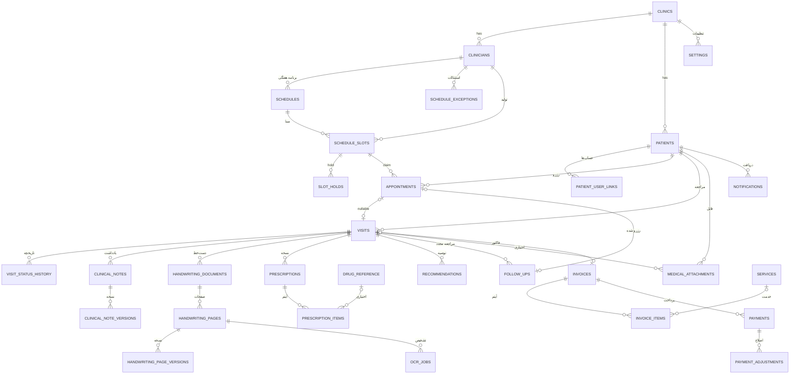

# ERD — CPMS

نسخه 1.0 | 2026-09-05 | فاز 4 | پیش‌شرط: SRS, State Machines تأییدشده

## 0. تصمیمات ساختاری کلیدی

| # | تصمیم | مرجع |
|---|---|---|
| D-1 | تمام جداول با پیش‌وند `cpms_`؛ ENGINE=InnoDB، CHARSET=utf8mb4، COLLATE=utf8mb4_unicode_ci | — |
| D-2 | `clinic_id` (FK→clinics) در **همه** جداول پزشکی → آماده چندشعبه (V1: مقدار 1) | ADR-0003 |
| D-3 | `clinician_id` (FK→clinicians) در Schedule/Slot/Appointment/Visit/Note/Prescription → آماده چندپزشک | ADR-0003 |
| D-4 | Primary Key: `BIGINT UNSIGNED AUTO_INCREMENT` (بدون GUID در PK؛ GUID فقط در جایی که لازم است — مثلاً hold token) | ADR-0011 |
| D-5 | زمان: `DATETIME(3)` مقدار UTC (به‌علاوه `TIMESTAMP` برای created/updated در جداول عمومی). Timezone کلینیک در `clinics.timezone` | ADR-0013 |
| D-6 | رابطه Appointment↔Visit: **Nullable دوطرفه** — `visits.appointment_id` (NULL=walk-in) و `appointments.active_visit_id` (NULL=هنوز مراجعه نکرده/نرسیده) | ADR-0005 |
| D-7 | Slot **مادی** (جدول `cpms_schedule_slots`) با شمارنده اتمیک `booked_count/held_count` → کنترل Double-Booking در سطح DB | ADR-0004 |
| D-8 | Stroke داده دست‌خط: **یک رکورد = یک صفحه** با `stroke_data` (JSON فشرده) — نقطه‌به‌نقطه Row جدا **ممنوع** | ADR-0009 |
| D-9 | نسخه‌بندی: Note/Handwriting جدول Version جدا (append-only)؛ Payment با Adjustment؛ Patient با Audit change-set | — |
| D-10 | Audit: جدول مستقل + Hash Chain؛ Operational Log جدا | ADR-0008 |
| D-11 | FKها: Logical + Physical در MySQL (InnoDB) برای داده‌های حیاتی؛ برای جداول High-Volume (audit, history, jobs) فقط Logical + Job صحت‌سنجی | ADR-0012 |
| D-12 | Soft-Delete: `deleted_at DATETIME(3) NULL` در جایی که فرایند Archive/Soft وجود دارد (patients, attachments, ...) | — |

## 1. دیاگرام (روابط اصلی)

## 2. فهرست جداول (۳۶ جدول)

| # | جدول | Domain | حجم تخمینی |
|---|---|---|---|
| 1 | `cpms_clinics` | ساختار | بسیار کم |
| 2 | `cpms_clinicians` | ساختار | کم |
| 3 | `cpms_patients` | بیمار | زیاد |
| 4 | `cpms_patient_user_links` | بیمار/احراز | زیاد |
| 5 | `cpms_patient_merges` | بیمار | کم |
| 6 | `cpms_otp_tokens` | احراز | متوسط (پاک‌سازی خودکار) |
| 7 | `cpms_idempotency_keys` | زیرساخت | متوسط (پاک‌سازی 90 روز) |
| 8 | `cpms_schedule` | نوبت‌دهی | کم |
| 9 | `cpms_schedule_exceptions` | نوبت‌دهی | کم |
| 10 | `cpms_schedule_slots` | نوبت‌دهی | **زیاد** (روز × پزشک × 30 روز) |
| 11 | `cpms_slot_holds` | نوبت‌دهی | متوسط (پاک‌سازی) |
| 12 | `cpms_appointments` | نوبت‌دهی | زیاد |
| 13 | `cpms_visits` | مراجعه | زیاد |
| 14 | `cpms_visit_status_history` | مراجعه | **زیاد** (append-only) |
| 15 | `cpms_clinical_notes` | بالینی | زیاد |
| 16 | `cpms_clinical_note_versions` | بالینی | زیاد (append-only) |
| 17 | `cpms_handwriting_documents` | دست‌خط | متوسط |
| 18 | `cpms_handwriting_pages` | دست‌خط | متوسط |
| 19 | `cpms_handwriting_page_versions` | دست‌خط | زیاد (append-only) |
| 20 | `cpms_ocr_jobs` | دست‌خط/OCR | کم |
| 21 | `cpms_prescriptions` | بالینی | زیاد |
| 22 | `cpms_prescription_items` | بالینی | زیاد |
| 23 | `cpms_drug_reference` | مرجع | ثابت |
| 24 | `cpms_recommendations` | بالینی | زیاد |
| 25 | `cpms_follow_ups` | بالینی | زیاد |
| 26 | `cpms_medical_attachments` | فایل | زیاد |
| 27 | `cpms_services` | مالی | کم |
| 28 | `cpms_invoices` | مالی | زیاد |
| 29 | `cpms_invoice_items` | مالی | زیاد |
| 30 | `cpms_payments` | مالی | زیاد |
| 31 | `cpms_payment_adjustments` | مالی | کم |
| 32 | `cpms_notifications` | اعلان | زیاد (archive/پاک‌سازی) |
| 33 | `cpms_jobs` | زیرساخت | زیاد (archive) |
| 34 | `cpms_audit_logs` | امنیت | **بسیار زیاد** (append-only) |
| 35 | `cpms_operational_logs` | پایش | بسیار زیاد (چرخه نگهداری) |
| 36 | `cpms_settings` | زیرساخت | بسیار کم |

> Data Dictionary کامل (فیلد، نوع، Constraint، Index): [data-dictionary.md](data-dictionary.md)

## 3. نکات Integrity مهم

- **K-1** `cpms_appointments`: `UNIQUE(patient_id, slot_date, slot_time)` روی رکوردهای فعال (از نظر logical؛ چون MySQL Partial Unique ندارد، با `slot_status_active` یا در Transaction بررسی می‌شود — انتخاب نهایی: **Transaction + check**، زیرا Unique شرطی پشتیبانی نمی‌شود؛ ریسک Race با Row Lock مدیریت می‌شود).
- **K-2** `cpms_schedule_slots`: `UNIQUE(clinician_id, slot_date, slot_time)` — تکراری‌زنی تولید Slot (Idempotent generation).
- **K-3** `cpms_payments`: `UNIQUE(invoice_id, idempotency_key)` — ضد Double Payment.
- **K-4** `cpms_invoices`: `UNIQUE(clinic_id, invoice_number)`؛ `cpms_payments`: `UNIQUE(clinic_id, payment_number)`.
- **K-5** `cpms_audit_logs`: فقط INSERT در سطح اپلیکیشن؛ `BEFORE UPDATE/DELETE` Trigger (اختیاری، سطح DB) در Production فعال می‌شود.
- **K-6** `cpms_visit_status_history`, `cpms_clinical_note_versions`, `cpms_handwriting_page_versions`: append-only (حذف/ویرایش در اپ ممنوع).
- **K-7** On Delete: برای FKهای حیاتی `RESTRICT` (بیمار با Visit/Note قابل حذف نیست)؛ برای جداول وابسته کم‌اهمیت `CASCADE` (مثلاً invoice_items→invoice).
- **K-8** جداول append-only/بزرگ: بدون FK فیزیکی (Logical) + Job موندگاری (موندایی) — تعادل Performance/Integrity (ADR-0012).
