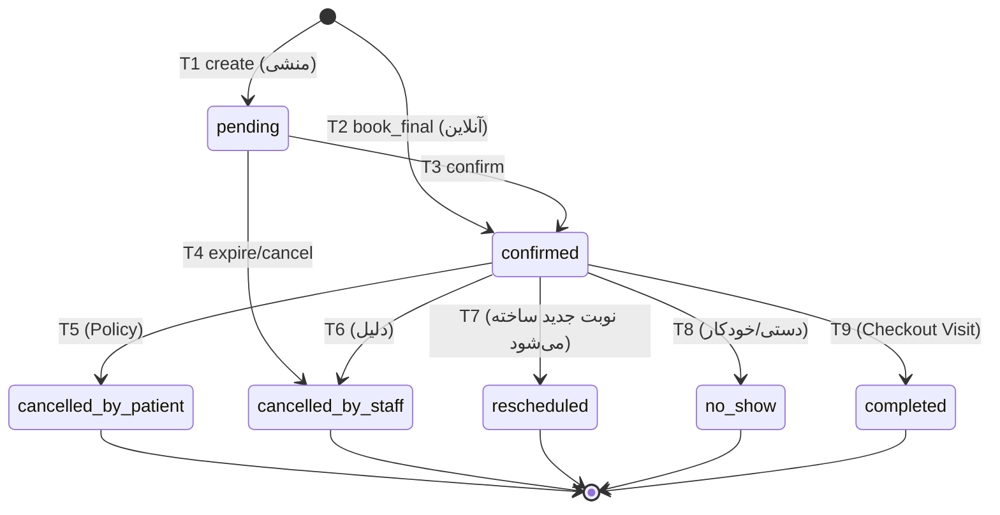

# State Machine — Appointment

نسخه 1.0 | 2026-09-05 | فاز 3 | وابسته به: SRS §3.5

## 1. حالت‌ها

| State | معنا | Terminal؟ |
|---|---|---|
| `pending` | ساخته شده، هنوز تأیید نشده (مثلاً ساخته‌شده توسط منشی برای تأیید پزشک؛ یا رزرو آنلاین قبل از گام نهایی) | خیر |
| `confirmed` | رزرو قطعی؛ Slot Claim شده | خیر |
| `cancelled_by_patient` | لغو توسط بیمار (در Policy) | ✅ |
| `cancelled_by_staff` | لغو توسط منشی/سیستم | ✅ |
| `rescheduled` | جابه‌جا شده → نوبت جدید (ارجاع به `rescheduled_to`) | ✅ |
| `completed` | Visit مرتبط Checkout شده (چرخه کامل تمام) | ✅ |
| `no_show` | بیمار نرسیده (دستی/خودکار) | ✅ |

> **Hold جداست:** Hold روی `cpms_slot_holds` (نه روی Appointment) است. Hold منقضی/لغو ≠ تغییر وضعیت Appointment (Appointment هنوز نساخته شده است).

## 2. Transitionها

| # | From | To | Trigger | Actor | شرایط | Side-Effects |
|---|---|---|---|---|---|---|
| T1 | — | `pending` | `create` | منشی (یا بیمار در جریان آنلاین پیش از گام نهایی) | Slot آزاد است | Hold/Claim Slot؛ Audit؛ اعلان (اختیاری) |
| T2 | — | `confirmed` | `book_final` (رزرو آنلاین) | بیمار Authenticated | Hold مالک + Slot آزاد در بازبینی نهایی | Claim Slot؛ کد نوبت؛ اعلان تأیید (SMS+Internal)؛ Audit |
| T3 | `pending` | `confirmed` | `confirm` | منشی/پزشک/سیستم | Slot آزاد | Claim Slot؛ اعلان؛ Audit |
| T4 | `pending` | `cancelled_by_staff` | `expire` / `cancel` | سیستم (Job) / منشی | — | آزادسازی Hold/Claim؛ Audit |
| T5 | `confirmed` | `cancelled_by_patient` | `cancel` | بیمار (خودش) | در Policy (≥ X ساعت قبل)؛ مالکیت؛ Visit فعال وجود ندارد | آزادسازی Slot؛ اعلان به مطب؛ Audit |
| T6 | `confirmed` | `cancelled_by_staff` | `cancel` | منشی/پزشک | دلیل الزامی؛ Visit فعال ندارد | آزادسازی Slot؛ اعلان به بیمار (در صورت فعال بودن کانال)؛ Audit |
| T7 | `confirmed` | `rescheduled` | `reschedule` | بیمار (Policy) / منشی | Slot جدید آزاد؛ در Policy | **اتوم:** ساخت نوبت جدید `confirmed` (Transfer Hold) + ارجاع دوطرفه + اعلان تغییر؛ Audit |
| T8 | `confirmed` | `no_show` | `mark_no_show` | منشی (دستی) یا Job (خودکار ≥ Grace Period) | Visit فعال برای این نوبت **ندارد** | Audit؛ (آمار) |
| T9 | `confirmed` | `completed` | `visit_checked_out` | سیستم (در Transaction Checkout) | Visit مرتبط `checked_out` باشد | هیچ (Slot قبلاً آزاد/مربوط به گذشته)؛ Audit |

## 3. دیاگرام

## 4. Invariants (قوانین سفت — در سطح دیتابیس/Transaction)

- **I-1** آزادسازی Slot فقط با T4/T5/T6. T7 Slot **قدیم** را آزاد و Slot **جدید** را Claim می‌کند (Transaction واحد).
- **I-2** هیچ Transitionی از حالت Terminal خروج ندارد.
- **I-3** T5/T6/T7/T8 وقتی `visit.active` وجود دارد **ممنوع** است (خطای `HAS_ACTIVE_VISIT`) — اگر بیمار رسیده، از فرایند Visit (cancel visit) باید استفاده شود.
- **I-4** دو نوبت فعال (pending/confirmed) هم‌زمان برای یک بیمار روی Slot یکسان ممکن نیست (Unique `patient_id + slot_date + slot_time` روی رکوردهای فعال، در سطح Transaction).
- **I-5** `completed` فقط از `confirmed` و فقط از مسیر Visit → Checkout (مسیر تکی؛ Anti Double-Complete).
- **I-6** هر Transition → Audit (action=`APPOINTMENT_TRANSITION`, before/after) + در صورت نیاز اعلان.

## 5. خطاها

| Code | موقعیت |
|---|---|
| `CLINIC_INVALID_TRANSITION` | Transition خارج از جدول (شامل تکرار) |
| `CLINIC_POLICY_VIOLATION` | لغو/جابه‌جا خارج از بازه Policy |
| `CLINIC_SLOT_TAKEN` | Slot جدید در T7 در لحظه غیرقابل‌claim است |
| `HAS_ACTIVE_VISIT` | I-3 |
| `NOT_OWNER` | بیمار روی نوبت خودش |
| `CLINIC_HOLD_EXPIRED` | Hold منقضی شده قبل از T2 |
