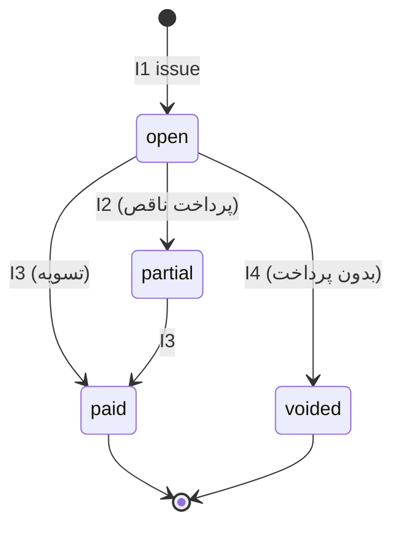
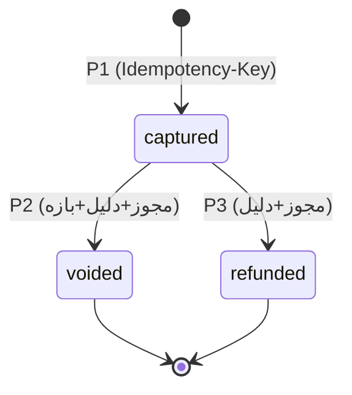

# State Machine — Invoice / Payment (مالی)

نسخه 1.0 | 2026-09-05 | فاز 3 | وابسته به: SRS §3.14, §3.15

## 0. قانون سفت
**Invoice ≠ Payment.** Invoice = بدهی (چه مبلغی باید پرداخت شود). Payment = تراکنش واقعی. Paymentها **Immutable** هستند؛ اصلاح فقط با **Adjustment** (Credit/Debit Note) و صفرکردن فقط با **Void** (در شرایط).

## 1. Invoice

### حالت‌ها
| State | معنا |
|---|---|
| `open` | صادر شده، هیچ پرداختی ندارد |
| `partial` | بخشی پرداخت شده |
| `paid` | تسویه کامل — Terminal |
| `voided` | ابطال (Terminal؛ فقط پیش از هر پرداخت) |

### Transitionها
| # | From | To | Trigger | Actor | شرایط | Side-Effects |
|---|---|---|---|---|---|---|
| I1 | — | `open` | `issue` | منشی/پزشک | Visit در `consultation_completed`/`awaiting_payment` | `invoice_number` یکتا؛ Visit→`awaiting_payment` (V11) |
| I2 | `open` | `partial` | `payment_captured` | سیستم (در Transaction ثبت Payment) | `paid_total < total` | به‌روزرسانی `paid_amount/balance` |
| I3 | `open` / `partial` | `paid` | `payment_captured` | سیستم | `paid_total ≥ total` (حداکثر = total؛ بیش‌پرداخت ممنوع → خطا) | Visit→`paid` (V12) |
| I4 | `open` | `voided` | `void` | منشی (مجوز `cpms_invoice_void`) | **هیچ** Payment فعال ندارد؛ دلیل الزامی | Visit می‌تواند به `in_consultation` برگردد یا Checkout بدون فاکتور (V13)؛ Audit |

## 2. Payment

### حالت‌ها
| State | معنا |
|---|---|
| `captured` | ثبت‌شده (Cash/POS/Online/Other) |
| `voided` | ابطال (Terminal) |
| `refunded` | بازنفسط (تمام/ناقص — Terminal روی این تراکنش) |

### Transitionها
| # | From | To | Trigger | Actor | شرایط | Side-Effects |
|---|---|---|---|---|---|---|
| P1 | — | `captured` | `capture` | منشی (مجوز `cpms_payment_create`) | Invoice در `open`/`partial`؛ `amount ≤ balance`؛ **Idempotency-Key** یکتا | `paid_at`، `received_by`؛ Invoice: I2/I3؛ Receipt قابل‌صدور |
| P2 | `captured` | `voided` | `void` | منشی (مجوز `cpms_payment_void` + دلیل) | بازه زمانی (پیش‌فرض همان روز) | Invoice: بازگردانی `paid_amount/balance` (Transaction)؛ Audit |
| P3 | `captured` | `refunded` | `refund` | منشی (مجوز `cpms_payment_refund` + دلیل + تایید دوم اختیاری) | `refund_amount ≤ amount - refunded` | رکورد Refund؛ Invoice بازگردانی؛ Audit |

> **Correction (اصلاح مبلغ اشتباه):** Payment **ویرایش نمی‌شود**. دو مسیر:
> - اگر اشتباه همان لحظه است: `void` (P2) + ثبت پرداخت صحیح (P1).
> - اگر بعداً: **Adjustment** (جدول `cpms_payment_adjustments`): `credit` (کسر از بدهی) یا `debit` (افزایش بدهی) با `reason + approved_by`؛ روی `balance` فاکتور اثر می‌دهد و در Report دیده می‌شود.

## 3. Invariants

- **M-1** `UNIQUE(invoice_id, idempotency_key)` — Double Payment در سطح DB جلوگیری می‌شود؛ T3 (تکرار کلاینت) همان پاسخ برمی‌گردد.
- **M-2** `UNIQUE(invoice_id, payment_number)`؛ شماره پرداخت به‌صورت `PAY-YYYYMMDD-####`.
- **M-3** مجموع پرداخت‌های `captured/refunded(جزء)` هرگز `total` را نمی‌شکند (بیش‌پرداخت = خطا `CLINIC_OVERPAYMENT`؛ اگر کارفرما خواست، Overpayment به‌عredit حساب بیمار — C).
- **M-4** هر Payment/Adjustment/Void → Audit (قبل/بعد: `paid_amount`, `balance`).
- **M-5** Receipt فقط از فاکتور + تراکنش‌های `captured` ساخته می‌شود (تولید مجدد = همان محتوا — Deterministic).
- **M-6** Refund/Void روی فاکتور `paid` یا `voided` ممنوع است.
- **M-7** هر عمل مالی در Transaction واحد با Invoice + Payment (+Visit status اگر I3) — atomic.

## 4. خطاها
| Code | موقعیت |
|---|---|
| `CLINIC_OVERPAYMENT` | M-3 |
| `DUPLICATE_IDEMPOTENCY` (→ idempotent replay، خطا نیست) | M-1 |
| `VOID_WINDOW_EXPIRED` | P2 خارج از بازه |
| `INVOICE_NOT_MODIFIABLE` | عمل روی فاکتور `paid/voided` |
| `CLINIC_PERMISSION_DENIED` | مجوز مالی |
