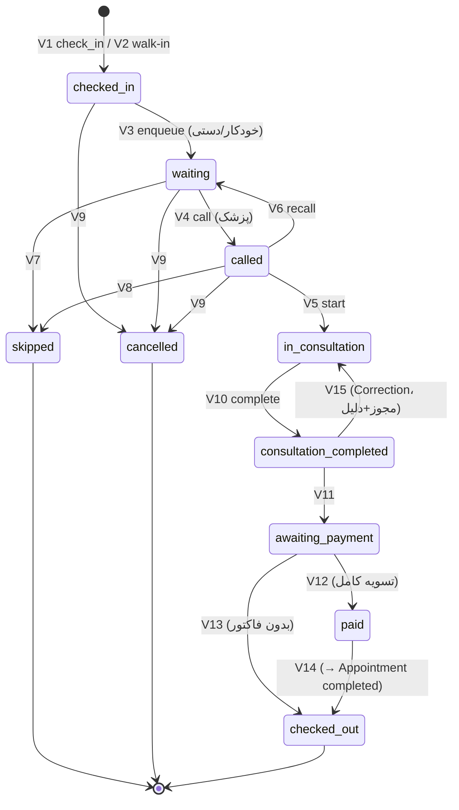

# State Machine — Visit / Queue

نسخه 1.0 | 2026-09-05 | فاز 3 | وابسته به: SRS §3.6, §3.7

## 1. حالت‌ها

| State | معنا |
|---|---|
| `checked_in` | بیمار وارد مطب شده (Visit ساخته/باز شده)؛ هنوز در صف پزشک نیست |
| `waiting` | در صف انتظار پزشک (FIFO + Priority) |
| `called` | پزشک فراخوانده؛ منتظر ورود به اتاق |
| `in_consultation` | در اتاق ویزیت |
| `consultation_completed` | ویزیت تمام شده؛ آماده مالی |
| `awaiting_payment` | در صف مالی (فاکتور ایجاد/مربوط) |
| `paid` | تسویه کامل |
| `checked_out` | خروج نهایی |
| `cancelled` | لغو (مثلاً Check-In اشتباه) — Terminal |
| `skipped` | رد شده توسط پزشک (با دلیل) — Terminal |

> `recalled` حالت **نیست**؛ یک Transition (event) است: `called → waiting` (با `recall_count+1` و Audit).
> `no_show` روی **Appointment** است (نه Visit) — بیمار اصلاً Visit نساخته.

## 2. Transitionها

| # | From | To | Trigger | Actor | شرایط | Side-Effects |
|---|---|---|---|---|---|---|
| V1 | — | `checked_in` | `check_in` | منشی | Patient وجود دارد؛ Visit فعال تکراری ندارد | ساخت Visit (+Link به Appointment اگر Scheduled)؛ `check_in_at`؛ History |
| V2 | — | `checked_in` | `create_walk_in` | منشی | Patient جدید/موجود | ساخت Visit `source=walk_in` |
| V3 | `checked_in` | `waiting` | `enqueue` | منشی **یا خودکار** (Setting، پیش‌فرض خودکار بلافاصله) | — | `waiting_since`؛ History |
| V4 | `waiting` | `called` | `call` | **پزشک** | Patient در صف؛ Room (اختیاری) | اعلان Real-Time به منشی (بیمار/پزشک/Room/زمان)؛ History |
| V5 | `called` | `in_consultation` | `start_consultation` | **پزشک** (یا منشی با مجوز، پیش‌فرض پزشک) | — | `consultation_started_at`؛ History |
| V6 | `called` | `waiting` | `recall` | پزشک | `recall_count < 3` (سپس باید skip کند) | `recall_count+1`؛ اعلان «بازگشت به صف»؛ History |
| V7 | `waiting` | `skipped` | `skip` | پزشک | دلیل الزامی | History + Audit |
| V8 | `called` | `skipped` | `skip` | پزشک | دلیل الزامی | History + Audit |
| V9 | `checked_in` / `waiting` / `called` | `cancelled` | `cancel` | منشی | دلیل الزامی (مثلاً Check-In اشتباه) | Visit خراب نمی‌شود (Soft)؛ History + Audit؛ امکان Check-In مجدد (Visit جدید) |
| V10 | `in_consultation` | `consultation_completed` | `complete` | **پزشک** | Validation (پیش‌فرض: Chief Complaint)؛ **یک‌بار فقط** (Lock Row + Transition Check) | `consultation_completed_at`؛ History + Audit |
| V11 | `consultation_completed` | `awaiting_payment` | `invoice_ready` | سیستم (اتوم هنگام ساخت/مربوط شدن فاکتور) یا منشی | — | History |
| V12 | `awaiting_payment` | `paid` | `settled` | سیستم (در Transaction ثبت پرداخت کامل) | `invoice.paid_total ≥ invoice.total` | History + اعلان به بیمار (اختیاری) |
| V13 | `awaiting_payment` | `checked_out` | `waive` | منشی/پزشک (مجوز) | دلیل الزامی (ویزیت بدون فاکتور) | History + Audit |
| V14 | `paid` | `checked_out` | `check_out` | منشی | — | `checked_out_at`؛ **اتوم: Appointment → completed (T9)**؛ History + Audit |
| V15 | `in_consultation` | — | — | — | **بازگشت** (FR-8.8): `consultation_completed` → `in_consultation` فقط با مجوز بالا + دلیل + Audit (Transition مستثنی V15) |

## 3. Invariants

- **J-1** `complete` (V10) اتمیک و یکتا است: Row Lock + بررسی Transition — تکرار = `CLINIC_INVALID_TRANSITION`.
- **J-2** `paid` فقط با تسویه کامل فاکتور (Partial نگه‌دارنده وضعیت `awaiting_payment`).
- **J-3** هر Transition → `cpms_visit_status_history` (append-only: from, to, at, actor, role, note). overwrite ممنوع.
- **J-4** ترتیب صف = `(priority DESC, waiting_since ASC)` روی Visitهای `waiting`.
- **J-5** هر بیمار × پزشک × روز: حداکثر یک Visit در حالت‌های فعال (checked_in → paid).
- **J-6** `recall_count` بر Visit (مرور: بیش از 3 Recall → باید Skip کند).
- **J-7** زمان‌های محاسباتی: `waiting_time = called_at - waiting_since`؛ `consultation_duration = consultation_completed_at - consultation_started_at`؛ `total_wait = in_consultation_at - check_in_at`.

## 4. خطاها

| Code | موقعیت |
|---|---|
| `CLINIC_INVALID_TRANSITION` | خارج از جدول (شامل Double Complete/Checkout) |
| `CLINIC_DUPLICATE_ACTIVE_VISIT` | J-5 |
| `RECALL_LIMIT` | بیش از حد Recall |
| `CLINIC_VALIDATION_FAILED` | V10 (Chief Complaint خالی و...) |
| `NOT_SETTLED` | V14 با فاکتور تسویه‌نشده |
